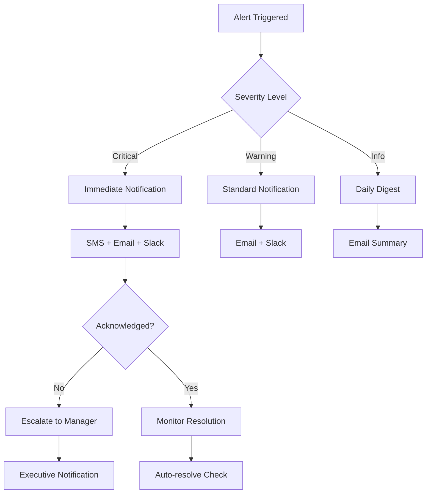

# 📊 GamifyX Observability Documentation

**Version:** 1.0.0  
**Last Updated:** October 22, 2025  
**Observability Team:** GamifyX Platform Engineering

## 📋 Table of Contents

- [Overview](#overview)
- [Observability Stack](#observability-stack)
- [Getting Started](#getting-started)
- [Metrics](#metrics)
- [Logging](#logging)
- [Tracing](#tracing)
- [Alerting](#alerting)
- [Dashboards](#dashboards)
- [Performance Monitoring](#performance-monitoring)
- [Business Intelligence](#business-intelligence)
- [Troubleshooting](#troubleshooting)
- [Best Practices](#best-practices)
- [API Reference](#api-reference)
- [Contributing](#contributing)

## 🔍 Overview

The GamifyX platform implements comprehensive observability to ensure optimal performance, reliability, and user experience. Our observability strategy follows the three pillars of observability: **Metrics**, **Logs**, and **Traces**, enhanced with business intelligence and educational analytics.

### Observability Principles

- **Full Stack Visibility:** End-to-end monitoring from frontend to database
- **Real-time Insights:** Sub-second metric collection and alerting
- **Educational Focus:** Learning analytics and student progress tracking
- **Proactive Monitoring:** Predictive alerts and anomaly detection
- **Data-Driven Decisions:** Business intelligence and performance optimization
- **Compliance Tracking:** Educational data privacy and audit trails

## 🏗️ Observability Stack

### Architecture Overview

```
┌─────────────────────────────────────────────────────────────┐
│                    Observability Layer                     │
├─────────────────────────────────────────────────────────────┤
│  ┌─────────────────┐  ┌─────────────────────────────────────┐│
│  │ Grafana         │  │ Prometheus                          ││
│  │ Dashboards      │  │ Metrics Collection                  ││
│  │                 │  │                                     ││
│  │ - System Metrics│  │ - Application Metrics               ││
│  │ - Business KPIs │  │ - Infrastructure Metrics            ││
│  │ - User Analytics│  │ - Custom Metrics                    ││
│  │ - Alerts        │  │ - Service Discovery                 ││
│  └─────────────────┘  └─────────────────────────────────────┘│
├─────────────────────────────────────────────────────────────┤
│  ┌─────────────────┐  ┌─────────────────────────────────────┐│
│  │ Jaeger          │  │ ELK Stack                           ││
│  │ Distributed     │  │ Centralized Logging                 ││
│  │ Tracing         │  │                                     ││
│  │                 │  │ - Elasticsearch (Storage)           ││
│  │ - Request Flow  │  │ - Logstash (Processing)             ││
│  │ - Performance   │  │ - Kibana (Visualization)            ││
│  │ - Dependencies  │  │ - Filebeat (Collection)             ││
│  │ - Error Tracking│  │ - Structured Logging                ││
│  └─────────────────┘  └─────────────────────────────────────┘│
├─────────────────────────────────────────────────────────────┤
│                  Application Instrumentation               │
├─────────────────────────────────────────────────────────────┤
│  ┌─────────────────┐  ┌─────────────────────────────────────┐│
│  │ OpenTelemetry   │  │ Custom Metrics                      ││
│  │                 │  │                                     ││
│  │ - Auto-instr.   │  │ - Learning Analytics                ││
│  │ - Manual Spans  │  │ - User Engagement                   ││
│  │ - Context Prop. │  │ - Performance Metrics               ││
│  │ - Sampling      │  │ - Business KPIs                     ││
│  └─────────────────┘  └─────────────────────────────────────┘│
└─────────────────────────────────────────────────────────────┘
```

### Technology Stack

| Component | Technology | Purpose | Port | Status |
|-----------|------------|---------|------|--------|
| **Metrics** | Prometheus | Time-series metrics collection | 9090 | ✅ Active |
| **Visualization** | Grafana | Dashboards and alerting | 3000 | ✅ Active |
| **Logging** | ELK Stack | Centralized log management | 9200 | ✅ Active |
| **Tracing** | Jaeger | Distributed request tracing | 16686 | ✅ Active |
| **APM** | OpenTelemetry | Application performance monitoring | - | ✅ Active |
| **Alerting** | AlertManager | Alert routing and management | 9093 | ✅ Active |

## 🚀 Getting Started

### Prerequisites

- Docker and Docker Compose
- Node.js 18+ (for custom instrumentation)
- Basic understanding of observability concepts
- Access to GamifyX platform services

### Quick Start

1. **Start the observability stack:**
   ```bash
   cd monitoring
   docker-compose up -d
   ```

2. **Verify services:**
   ```bash
   # Check Prometheus
   curl http://localhost:9090/api/v1/status/config

   # Check Grafana
   curl http://localhost:3000/api/health

   # Check Jaeger
   curl http://localhost:16686/api/services
   ```

3. **Access dashboards:**
   - Grafana: http://localhost:3000 (admin/admin)
   - Prometheus: http://localhost:9090
   - Jaeger: http://localhost:16686
   - Kibana: http://localhost:5601

### Configuration

**Environment Variables:**
```env
# Prometheus Configuration
PROMETHEUS_PORT=9090
PROMETHEUS_RETENTION=30d
PROMETHEUS_SCRAPE_INTERVAL=15s

# Grafana Configuration
GRAFANA_PORT=3000
GRAFANA_ADMIN_USER=admin
GRAFANA_ADMIN_PASSWORD=admin
GRAFANA_DATABASE_TYPE=postgres

# Jaeger Configuration
JAEGER_COLLECTOR_PORT=14268
JAEGER_QUERY_PORT=16686
JAEGER_SAMPLING_RATE=0.1

# ELK Configuration
ELASTICSEARCH_PORT=9200
KIBANA_PORT=5601
LOGSTASH_PORT=5044
```

## 📈 Metrics

### Application Metrics

**Core Application Metrics:**
```javascript
// Custom metrics instrumentation
const prometheus = require('prom-client');

// Counter: Total requests
const httpRequestsTotal = new prometheus.Counter({
  name: 'http_requests_total',
  help: 'Total number of HTTP requests',
  labelNames: ['method', 'route', 'status_code']
});

// Histogram: Request duration
const httpRequestDuration = new prometheus.Histogram({
  name: 'http_request_duration_seconds',
  help: 'Duration of HTTP requests in seconds',
  labelNames: ['method', 'route'],
  buckets: [0.1, 0.5, 1, 2, 5]
});

// Gauge: Active users
const activeUsers = new prometheus.Gauge({
  name: 'gamifyx_active_users',
  help: 'Number of currently active users'
});

// Educational metrics
const submissionsTotal = new prometheus.Counter({
  name: 'gamifyx_submissions_total',
  help: 'Total number of submissions',
  labelNames: ['status', 'difficulty', 'category']
});

const learningProgress = new prometheus.Gauge({
  name: 'gamifyx_learning_progress',
  help: 'Student learning progress percentage',
  labelNames: ['student_id', 'course_id']
});
```

### Business Metrics

**Key Performance Indicators:**
```yaml
business_metrics:
  engagement:
    - daily_active_users
    - session_duration
    - page_views
    - feature_usage
  
  learning:
    - completion_rate
    - average_score
    - time_to_completion
    - skill_progression
  
  platform:
    - user_retention
    - course_enrollment
    - submission_rate
    - feedback_quality
```

### Infrastructure Metrics

**System Metrics:**
- CPU utilization
- Memory usage
- Disk I/O
- Network traffic
- Container metrics
- Kubernetes metrics

**Database Metrics:**
- Query performance
- Connection pool usage
- Transaction rates
- Lock contention
- Replication lag

### Custom Metrics Collection

```javascript
// Learning analytics metrics
class LearningAnalytics {
  constructor() {
    this.completionRate = new prometheus.Gauge({
      name: 'course_completion_rate',
      help: 'Course completion rate by course',
      labelNames: ['course_id', 'difficulty']
    });

    this.averageScore = new prometheus.Gauge({
      name: 'average_assignment_score',
      help: 'Average score for assignments',
      labelNames: ['assignment_id', 'course_id']
    });

    this.engagementTime = new prometheus.Histogram({
      name: 'user_engagement_time_seconds',
      help: 'Time spent by users on platform',
      labelNames: ['user_type', 'feature'],
      buckets: [60, 300, 900, 1800, 3600] // 1min to 1hour
    });
  }

  recordCompletion(courseId, difficulty, rate) {
    this.completionRate.set({ course_id: courseId, difficulty }, rate);
  }

  recordScore(assignmentId, courseId, score) {
    this.averageScore.set({ assignment_id: assignmentId, course_id: courseId }, score);
  }

  recordEngagement(userType, feature, timeSeconds) {
    this.engagementTime.observe({ user_type: userType, feature }, timeSeconds);
  }
}
```

## 📝 Logging

### Structured Logging

**Log Format:**
```json
{
  "timestamp": "2025-10-22T12:00:00.000Z",
  "level": "info",
  "service": "user-service",
  "traceId": "abc123def456",
  "spanId": "789ghi012jkl",
  "userId": "user123",
  "action": "login",
  "message": "User login successful",
  "metadata": {
    "ip": "192.168.1.100",
    "userAgent": "Mozilla/5.0...",
    "duration": 150
  }
}
```

**Logging Implementation:**
```javascript
const winston = require('winston');
const { ElasticsearchTransport } = require('winston-elasticsearch');

// Configure structured logging
const logger = winston.createLogger({
  level: 'info',
  format: winston.format.combine(
    winston.format.timestamp(),
    winston.format.errors({ stack: true }),
    winston.format.json()
  ),
  defaultMeta: {
    service: process.env.SERVICE_NAME || 'gamifyx-service'
  },
  transports: [
    // Console output for development
    new winston.transports.Console({
      format: winston.format.combine(
        winston.format.colorize(),
        winston.format.simple()
      )
    }),
    
    // Elasticsearch for production
    new ElasticsearchTransport({
      level: 'info',
      clientOpts: {
        node: process.env.ELASTICSEARCH_URL || 'http://localhost:9200'
      },
      index: 'gamifyx-logs'
    })
  ]
});

// Educational event logging
class EducationalLogger {
  static logSubmission(userId, assignmentId, score, metadata = {}) {
    logger.info('Assignment submission', {
      event: 'submission',
      userId,
      assignmentId,
      score,
      ...metadata
    });
  }

  static logLearningProgress(userId, courseId, progress, metadata = {}) {
    logger.info('Learning progress update', {
      event: 'progress',
      userId,
      courseId,
      progress,
      ...metadata
    });
  }

  static logUserEngagement(userId, feature, duration, metadata = {}) {
    logger.info('User engagement', {
      event: 'engagement',
      userId,
      feature,
      duration,
      ...metadata
    });
  }
}
```

### Log Categories

**Application Logs:**
- Request/response logs
- Error and exception logs
- Performance logs
- Security events
- Business events

**Educational Logs:**
- Student submissions
- Learning progress
- Course interactions
- Assessment results
- Feedback events

**System Logs:**
- Infrastructure events
- Deployment logs
- Configuration changes
- Health checks
- Resource usage

### Log Retention Policy

```yaml
retention_policy:
  application_logs:
    hot_tier: 7d      # Fast access
    warm_tier: 30d    # Standard access
    cold_tier: 90d    # Archive access
    deletion: 365d    # Permanent deletion
  
  audit_logs:
    hot_tier: 30d
    warm_tier: 90d
    cold_tier: 365d
    deletion: 2555d   # 7 years for compliance
  
  security_logs:
    hot_tier: 30d
    warm_tier: 180d
    cold_tier: 365d
    deletion: 2555d   # 7 years for compliance
```

## 🔍 Tracing

### Distributed Tracing Setup

**OpenTelemetry Configuration:**
```javascript
const { NodeSDK } = require('@opentelemetry/sdk-node');
const { getNodeAutoInstrumentations } = require('@opentelemetry/auto-instrumentations-node');
const { JaegerExporter } = require('@opentelemetry/exporter-jaeger');
const { Resource } = require('@opentelemetry/resources');
const { SemanticResourceAttributes } = require('@opentelemetry/semantic-conventions');

// Initialize OpenTelemetry
const sdk = new NodeSDK({
  resource: new Resource({
    [SemanticResourceAttributes.SERVICE_NAME]: 'gamifyx-service',
    [SemanticResourceAttributes.SERVICE_VERSION]: '1.0.0',
  }),
  traceExporter: new JaegerExporter({
    endpoint: process.env.JAEGER_ENDPOINT || 'http://localhost:14268/api/traces',
  }),
  instrumentations: [getNodeAutoInstrumentations()],
});

sdk.start();
```

### Custom Spans

**Educational Workflow Tracing:**
```javascript
const { trace } = require('@opentelemetry/api');

class EducationalTracing {
  static async traceSubmissionProcessing(submissionId, userId, callback) {
    const tracer = trace.getTracer('gamifyx-education');
    
    return tracer.startActiveSpan('submission.process', {
      attributes: {
        'submission.id': submissionId,
        'user.id': userId,
        'operation': 'process_submission'
      }
    }, async (span) => {
      try {
        // Add custom events
        span.addEvent('submission.validation.start');
        
        const result = await callback();
        
        span.addEvent('submission.validation.complete', {
          'validation.result': result.isValid,
          'validation.score': result.score
        });
        
        span.setAttributes({
          'submission.status': result.status,
          'submission.score': result.score,
          'submission.feedback_generated': result.hasFeedback
        });
        
        span.setStatus({ code: trace.SpanStatusCode.OK });
        return result;
      } catch (error) {
        span.recordException(error);
        span.setStatus({
          code: trace.SpanStatusCode.ERROR,
          message: error.message
        });
        throw error;
      } finally {
        span.end();
      }
    });
  }

  static async traceLearningPath(userId, courseId, callback) {
    const tracer = trace.getTracer('gamifyx-learning');
    
    return tracer.startActiveSpan('learning.path.traverse', {
      attributes: {
        'user.id': userId,
        'course.id': courseId,
        'operation': 'learning_path'
      }
    }, callback);
  }
}
```

### Trace Analysis

**Performance Analysis:**
- Request latency breakdown
- Service dependency mapping
- Bottleneck identification
- Error propagation tracking

**Educational Analytics:**
- Student learning journey mapping
- Assignment completion flow
- Feedback generation pipeline
- Gamification event tracking

## 🚨 Alerting

### Alert Rules

**Prometheus Alert Rules:**
```yaml
groups:
  - name: gamifyx.rules
    rules:
      # High error rate
      - alert: HighErrorRate
        expr: rate(http_requests_total{status_code=~"5.."}[5m]) > 0.1
        for: 5m
        labels:
          severity: critical
        annotations:
          summary: "High error rate detected"
          description: "Error rate is {{ $value }} errors per second"

      # High response time
      - alert: HighResponseTime
        expr: histogram_quantile(0.95, rate(http_request_duration_seconds_bucket[5m])) > 2
        for: 5m
        labels:
          severity: warning
        annotations:
          summary: "High response time detected"
          description: "95th percentile response time is {{ $value }}s"

      # Low course completion rate
      - alert: LowCompletionRate
        expr: course_completion_rate < 0.6
        for: 10m
        labels:
          severity: warning
          category: educational
        annotations:
          summary: "Low course completion rate"
          description: "Course {{ $labels.course_id }} has completion rate of {{ $value }}"

      # High student dropout
      - alert: HighStudentDropout
        expr: increase(student_dropout_total[1h]) > 10
        for: 5m
        labels:
          severity: critical
          category: educational
        annotations:
          summary: "High student dropout rate"
          description: "{{ $value }} students dropped out in the last hour"
```

### Alert Channels

**Notification Configuration:**
```yaml
alertmanager_config:
  global:
    smtp_smarthost: 'localhost:587'
    smtp_from: 'alerts@gamifyx.com'

  route:
    group_by: ['alertname', 'severity']
    group_wait: 10s
    group_interval: 10s
    repeat_interval: 1h
    receiver: 'default'
    routes:
      - match:
          severity: critical
        receiver: 'critical-alerts'
      - match:
          category: educational
        receiver: 'education-team'

  receivers:
    - name: 'default'
      email_configs:
        - to: 'team@gamifyx.com'
          subject: 'GamifyX Alert: {{ .GroupLabels.alertname }}'
          body: |
            {{ range .Alerts }}
            Alert: {{ .Annotations.summary }}
            Description: {{ .Annotations.description }}
            {{ end }}

    - name: 'critical-alerts'
      email_configs:
        - to: 'oncall@gamifyx.com'
          subject: 'CRITICAL: {{ .GroupLabels.alertname }}'
      slack_configs:
        - api_url: 'YOUR_SLACK_WEBHOOK_URL'
          channel: '#alerts-critical'
          title: 'Critical Alert'
          text: '{{ .CommonAnnotations.summary }}'

    - name: 'education-team'
      email_configs:
        - to: 'education@gamifyx.com'
          subject: 'Educational Alert: {{ .GroupLabels.alertname }}'
```

### Alert Escalation



## 📊 Dashboards

### Grafana Dashboards

**System Overview Dashboard:**
```json
{
  "dashboard": {
    "title": "GamifyX System Overview",
    "panels": [
      {
        "title": "Request Rate",
        "type": "graph",
        "targets": [
          {
            "expr": "rate(http_requests_total[5m])",
            "legendFormat": "{{method}} {{route}}"
          }
        ]
      },
      {
        "title": "Response Time",
        "type": "graph",
        "targets": [
          {
            "expr": "histogram_quantile(0.95, rate(http_request_duration_seconds_bucket[5m]))",
            "legendFormat": "95th percentile"
          }
        ]
      },
      {
        "title": "Active Users",
        "type": "singlestat",
        "targets": [
          {
            "expr": "gamifyx_active_users",
            "legendFormat": "Active Users"
          }
        ]
      }
    ]
  }
}
```

**Educational Analytics Dashboard:**
```json
{
  "dashboard": {
    "title": "Educational Analytics",
    "panels": [
      {
        "title": "Course Completion Rates",
        "type": "bargauge",
        "targets": [
          {
            "expr": "course_completion_rate",
            "legendFormat": "{{course_id}}"
          }
        ]
      },
      {
        "title": "Average Assignment Scores",
        "type": "graph",
        "targets": [
          {
            "expr": "average_assignment_score",
            "legendFormat": "{{course_id}}"
          }
        ]
      },
      {
        "title": "Student Engagement Time",
        "type": "heatmap",
        "targets": [
          {
            "expr": "rate(user_engagement_time_seconds_bucket[5m])",
            "legendFormat": "{{feature}}"
          }
        ]
      }
    ]
  }
}
```

### Dashboard Categories

**Infrastructure Dashboards:**
- System resource utilization
- Container and Kubernetes metrics
- Database performance
- Network and storage metrics

**Application Dashboards:**
- Service performance metrics
- API endpoint monitoring
- Error rates and patterns
- User session analytics

**Business Dashboards:**
- Educational KPIs
- Student engagement metrics
- Course effectiveness
- Revenue and growth metrics

## 🎯 Performance Monitoring

### Application Performance Monitoring (APM)

**Performance Metrics:**
```javascript
class PerformanceMonitor {
  constructor() {
    this.responseTime = new prometheus.Histogram({
      name: 'api_response_time_seconds',
      help: 'API response time in seconds',
      labelNames: ['endpoint', 'method'],
      buckets: [0.01, 0.05, 0.1, 0.5, 1, 2, 5]
    });

    this.throughput = new prometheus.Counter({
      name: 'api_requests_total',
      help: 'Total API requests',
      labelNames: ['endpoint', 'method', 'status']
    });

    this.errorRate = new prometheus.Counter({
      name: 'api_errors_total',
      help: 'Total API errors',
      labelNames: ['endpoint', 'method', 'error_type']
    });
  }

  middleware() {
    return (req, res, next) => {
      const start = Date.now();
      
      res.on('finish', () => {
        const duration = (Date.now() - start) / 1000;
        const endpoint = req.route?.path || req.path;
        
        this.responseTime.observe(
          { endpoint, method: req.method },
          duration
        );
        
        this.throughput.inc({
          endpoint,
          method: req.method,
          status: res.statusCode
        });
        
        if (res.statusCode >= 400) {
          this.errorRate.inc({
            endpoint,
            method: req.method,
            error_type: res.statusCode >= 500 ? 'server_error' : 'client_error'
          });
        }
      });
      
      next();
    };
  }
}
```

### Database Performance

**Database Monitoring:**
```javascript
const { Pool } = require('pg');

class DatabaseMonitor {
  constructor(pool) {
    this.pool = pool;
    this.setupMetrics();
  }

  setupMetrics() {
    this.queryDuration = new prometheus.Histogram({
      name: 'db_query_duration_seconds',
      help: 'Database query duration',
      labelNames: ['query_type', 'table'],
      buckets: [0.001, 0.01, 0.1, 1, 5]
    });

    this.connectionPool = new prometheus.Gauge({
      name: 'db_connection_pool_size',
      help: 'Database connection pool size',
      labelNames: ['state']
    });

    // Monitor connection pool
    setInterval(() => {
      this.connectionPool.set({ state: 'total' }, this.pool.totalCount);
      this.connectionPool.set({ state: 'idle' }, this.pool.idleCount);
      this.connectionPool.set({ state: 'waiting' }, this.pool.waitingCount);
    }, 5000);
  }

  async query(text, params, queryType = 'unknown', table = 'unknown') {
    const start = Date.now();
    
    try {
      const result = await this.pool.query(text, params);
      const duration = (Date.now() - start) / 1000;
      
      this.queryDuration.observe({ query_type: queryType, table }, duration);
      
      return result;
    } catch (error) {
      const duration = (Date.now() - start) / 1000;
      this.queryDuration.observe({ query_type: queryType, table }, duration);
      throw error;
    }
  }
}
```

### Frontend Performance

**Real User Monitoring (RUM):**
```javascript
// Frontend performance monitoring
class FrontendMonitor {
  constructor() {
    this.initializePerformanceObserver();
    this.trackUserInteractions();
  }

  initializePerformanceObserver() {
    if ('PerformanceObserver' in window) {
      // Monitor Core Web Vitals
      const observer = new PerformanceObserver((list) => {
        for (const entry of list.getEntries()) {
          this.sendMetric({
            name: entry.name,
            value: entry.value,
            type: 'web_vital',
            timestamp: Date.now()
          });
        }
      });

      observer.observe({ entryTypes: ['measure', 'navigation', 'paint'] });
    }
  }

  trackUserInteractions() {
    // Track page load times
    window.addEventListener('load', () => {
      const navigation = performance.getEntriesByType('navigation')[0];
      
      this.sendMetric({
        name: 'page_load_time',
        value: navigation.loadEventEnd - navigation.fetchStart,
        type: 'performance',
        page: window.location.pathname
      });
    });

    // Track user engagement
    let engagementStart = Date.now();
    
    document.addEventListener('visibilitychange', () => {
      if (document.hidden) {
        const engagementTime = Date.now() - engagementStart;
        this.sendMetric({
          name: 'engagement_time',
          value: engagementTime,
          type: 'engagement',
          page: window.location.pathname
        });
      } else {
        engagementStart = Date.now();
      }
    });
  }

  sendMetric(metric) {
    fetch('/api/metrics', {
      method: 'POST',
      headers: { 'Content-Type': 'application/json' },
      body: JSON.stringify(metric)
    }).catch(console.error);
  }
}

// Initialize frontend monitoring
new FrontendMonitor();
```

## 📚 Business Intelligence

### Educational Analytics

**Learning Analytics Dashboard:**
```javascript
class LearningAnalytics {
  constructor() {
    this.setupEducationalMetrics();
  }

  setupEducationalMetrics() {
    // Student progress tracking
    this.studentProgress = new prometheus.Gauge({
      name: 'student_progress_percentage',
      help: 'Student progress in courses',
      labelNames: ['student_id', 'course_id', 'module_id']
    });

    // Assignment completion rates
    this.assignmentCompletion = new prometheus.Gauge({
      name: 'assignment_completion_rate',
      help: 'Assignment completion rate',
      labelNames: ['assignment_id', 'difficulty', 'category']
    });

    // Learning outcome achievement
    this.learningOutcomes = new prometheus.Counter({
      name: 'learning_outcomes_achieved_total',
      help: 'Total learning outcomes achieved',
      labelNames: ['outcome_id', 'course_id', 'student_id']
    });

    // Skill development tracking
    this.skillDevelopment = new prometheus.Gauge({
      name: 'skill_level',
      help: 'Student skill level',
      labelNames: ['student_id', 'skill_name', 'assessment_type']
    });
  }

  trackStudentProgress(studentId, courseId, moduleId, progress) {
    this.studentProgress.set(
      { student_id: studentId, course_id: courseId, module_id: moduleId },
      progress
    );
  }

  trackAssignmentCompletion(assignmentId, difficulty, category, rate) {
    this.assignmentCompletion.set(
      { assignment_id: assignmentId, difficulty, category },
      rate
    );
  }

  trackLearningOutcome(outcomeId, courseId, studentId) {
    this.learningOutcomes.inc({
      outcome_id: outcomeId,
      course_id: courseId,
      student_id: studentId
    });
  }

  trackSkillDevelopment(studentId, skillName, assessmentType, level) {
    this.skillDevelopment.set(
      { student_id: studentId, skill_name: skillName, assessment_type: assessmentType },
      level
    );
  }
}
```

### Engagement Analytics

**User Engagement Tracking:**
```javascript
class EngagementAnalytics {
  constructor() {
    this.setupEngagementMetrics();
  }

  setupEngagementMetrics() {
    // Session duration
    this.sessionDuration = new prometheus.Histogram({
      name: 'user_session_duration_seconds',
      help: 'User session duration',
      labelNames: ['user_type', 'device_type'],
      buckets: [60, 300, 900, 1800, 3600, 7200] // 1min to 2hours
    });

    // Feature usage
    this.featureUsage = new prometheus.Counter({
      name: 'feature_usage_total',
      help: 'Feature usage count',
      labelNames: ['feature_name', 'user_type', 'context']
    });

    // Content interaction
    this.contentInteraction = new prometheus.Counter({
      name: 'content_interaction_total',
      help: 'Content interaction count',
      labelNames: ['content_type', 'interaction_type', 'content_id']
    });

    // Gamification engagement
    this.gamificationEngagement = new prometheus.Counter({
      name: 'gamification_engagement_total',
      help: 'Gamification element engagement',
      labelNames: ['element_type', 'action', 'user_id']
    });
  }

  trackSession(userId, userType, deviceType, duration) {
    this.sessionDuration.observe(
      { user_type: userType, device_type: deviceType },
      duration
    );
  }

  trackFeatureUsage(featureName, userType, context) {
    this.featureUsage.inc({
      feature_name: featureName,
      user_type: userType,
      context
    });
  }

  trackContentInteraction(contentType, interactionType, contentId) {
    this.contentInteraction.inc({
      content_type: contentType,
      interaction_type: interactionType,
      content_id: contentId
    });
  }

  trackGamificationEngagement(elementType, action, userId) {
    this.gamificationEngagement.inc({
      element_type: elementType,
      action,
      user_id: userId
    });
  }
}
```

## 🔧 Troubleshooting

### Common Issues

**Metrics Not Appearing:**
```bash
# Check Prometheus targets
curl http://localhost:9090/api/v1/targets

# Verify service discovery
curl http://localhost:9090/api/v1/label/__name__/values

# Check metric exposition
curl http://localhost:3001/metrics
```

**High Cardinality Issues:**
```javascript
// Avoid high cardinality labels
// BAD: Using user ID as label
const badMetric = new prometheus.Counter({
  name: 'user_actions',
  labelNames: ['user_id', 'action'] // user_id has high cardinality
});

// GOOD: Use aggregated labels
const goodMetric = new prometheus.Counter({
  name: 'user_actions',
  labelNames: ['user_type', 'action'] // user_type has low cardinality
});
```

**Tracing Issues:**
```bash
# Check Jaeger collector
curl http://localhost:14268/api/traces

# Verify trace sampling
export JAEGER_SAMPLER_TYPE=const
export JAEGER_SAMPLER_PARAM=1

# Check trace propagation
curl -H "uber-trace-id: trace-id:span-id:parent-id:flags" http://localhost:3001/api/test
```

### Performance Optimization

**Metric Collection Optimization:**
```javascript
// Use metric caching for expensive calculations
class MetricCache {
  constructor(ttl = 60000) { // 1 minute TTL
    this.cache = new Map();
    this.ttl = ttl;
  }

  get(key, calculator) {
    const cached = this.cache.get(key);
    const now = Date.now();

    if (cached && (now - cached.timestamp) < this.ttl) {
      return cached.value;
    }

    const value = calculator();
    this.cache.set(key, { value, timestamp: now });
    return value;
  }
}

const metricCache = new MetricCache();

// Use cached metrics for expensive calculations
function getComplexMetric() {
  return metricCache.get('complex_metric', () => {
    // Expensive calculation here
    return calculateComplexValue();
  });
}
```

### Debug Mode

**Enable Debug Logging:**
```bash
# Enable debug mode for all observability components
export DEBUG=prometheus:*,grafana:*,jaeger:*
export LOG_LEVEL=debug

# Start services with debug logging
docker-compose -f docker-compose.debug.yml up
```

## 📖 Best Practices

### Metric Design

**Naming Conventions:**
```yaml
metric_naming:
  format: "{namespace}_{subsystem}_{name}_{unit}"
  examples:
    - "gamifyx_http_requests_total"
    - "gamifyx_db_query_duration_seconds"
    - "gamifyx_student_progress_percentage"
  
  guidelines:
    - Use snake_case for metric names
    - Include units in metric names
    - Use consistent prefixes
    - Avoid high cardinality labels
```

**Label Best Practices:**
```javascript
// Good label design
const httpRequests = new prometheus.Counter({
  name: 'http_requests_total',
  labelNames: ['method', 'route', 'status_code'] // Low cardinality
});

// Bad label design
const badHttpRequests = new prometheus.Counter({
  name: 'http_requests_total',
  labelNames: ['method', 'full_url', 'user_id'] // High cardinality
});
```

### Logging Best Practices

**Structured Logging:**
```javascript
// Good structured logging
logger.info('User login successful', {
  userId: 'user123',
  loginMethod: 'password',
  ipAddress: '192.168.1.100',
  duration: 150,
  timestamp: new Date().toISOString()
});

// Bad unstructured logging
logger.info(`User user123 logged in from 192.168.1.100 in 150ms`);
```

### Alerting Best Practices

**Alert Design:**
```yaml
alert_guidelines:
  - Alert on symptoms, not causes
  - Use appropriate thresholds
  - Include actionable information
  - Avoid alert fatigue
  - Test alert conditions
  
  severity_levels:
    critical: "Immediate action required"
    warning: "Action required within hours"
    info: "Informational, no action required"
```

## 📚 API Reference

### Metrics API

**Prometheus Metrics Endpoint:**
```bash
# Get all metrics
GET /metrics

# Query specific metrics
GET /api/v1/query?query=http_requests_total

# Query range
GET /api/v1/query_range?query=http_requests_total&start=2025-10-22T00:00:00Z&end=2025-10-22T23:59:59Z&step=5m
```

### Custom Metrics API

**Educational Metrics Endpoints:**
```bash
# Student progress
POST /api/metrics/student/progress
{
  "studentId": "student123",
  "courseId": "course456",
  "progress": 75.5
}

# Assignment completion
POST /api/metrics/assignment/completion
{
  "assignmentId": "assignment789",
  "completionRate": 0.85,
  "averageScore": 88.5
}

# Engagement tracking
POST /api/metrics/engagement
{
  "userId": "user123",
  "feature": "video_player",
  "duration": 1800,
  "interactions": 15
}
```

## 🤝 Contributing

### Adding New Metrics

1. **Define the metric:**
   ```javascript
   const newMetric = new prometheus.Counter({
     name: 'gamifyx_new_feature_usage_total',
     help: 'Usage count for new feature',
     labelNames: ['feature_type', 'user_type']
   });
   ```

2. **Add instrumentation:**
   ```javascript
   function trackNewFeature(featureType, userType) {
     newMetric.inc({ feature_type: featureType, user_type: userType });
   }
   ```

3. **Create dashboard panel:**
   ```json
   {
     "title": "New Feature Usage",
     "type": "graph",
     "targets": [
       {
         "expr": "rate(gamifyx_new_feature_usage_total[5m])",
         "legendFormat": "{{feature_type}}"
       }
     ]
   }
   ```

4. **Add alert rule:**
   ```yaml
   - alert: LowNewFeatureUsage
     expr: rate(gamifyx_new_feature_usage_total[1h]) < 0.1
     for: 30m
     labels:
       severity: warning
   ```

### Dashboard Development

**Dashboard Guidelines:**
- Use consistent color schemes
- Include appropriate time ranges
- Add meaningful legends
- Implement drill-down capabilities
- Test with different data ranges

### Testing Observability

**Metric Testing:**
```javascript
describe('Metrics', () => {
  it('should increment request counter', () => {
    const initialValue = httpRequestsTotal.get();
    
    // Simulate request
    httpRequestsTotal.inc({ method: 'GET', route: '/api/test', status_code: '200' });
    
    const newValue = httpRequestsTotal.get();
    expect(newValue).toBeGreaterThan(initialValue);
  });
});
```

## 📞 Support and Contact

### Observability Team

- **Platform Engineering:** platform@gamifyx.com
- **SRE Team:** sre@gamifyx.com
- **Data Analytics:** analytics@gamifyx.com

### Resources

- **Grafana Dashboards:** http://localhost:3000
- **Prometheus Queries:** http://localhost:9090
- **Jaeger Traces:** http://localhost:16686
- **Documentation:** https://docs.gamifyx.com/observability

---

## 📄 License and Legal

This observability documentation is proprietary and confidential. Distribution is restricted to authorized personnel only.

**Copyright © 2025 GamifyX Platform Engineering Team. All rights reserved.**

---

*Last updated: October 22, 2025*  
*Next review: November 22, 2025*  
*Document version: 1.0.0*