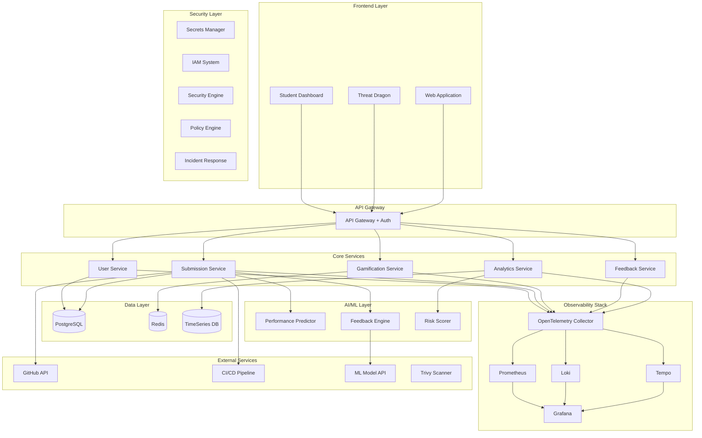

# AIOps Learning Platform Design Document

## Overview

The AIOps Learning Platform is a cloud-native, microservices-based system that combines gamification, artificial intelligence, and comprehensive observability to create an engaging DevOps learning environment. The platform leverages OpenTelemetry for instrumentation, Grafana for visualization, and AI/ML models for predictive analytics and automated feedback.

**One-liner:** "Gamification makes learning fun, AIOps makes it smart – together, they help every student perform their best."

## Architecture

### High-Level Architecture



### Technology Stack

- **Frontend**: React.js with TypeScript, Chart.js/D3.js for visualizations
- **Backend**: Node.js/Express.js microservices
- **Database**: PostgreSQL (primary), Redis (caching), InfluxDB (time-series)
- **Observability**: OpenTelemetry, Prometheus, Grafana, Loki, Tempo
- **AI/ML**: Python FastAPI services, scikit-learn, TensorFlow Lite
- **Infrastructure**: Docker, Kubernetes, GitHub Actions
- **Monitoring**: Custom Grafana dashboards with AI-powered insights
- **Security**: OWASP Threat Dragon, Trivy, Checkov, HashiCorp Vault CE, AWS Secrets Manager
- **Compliance**: NIST 800-53, CIS Controls, automated policy enforcement

## Components and Interfaces

### 1. User Service
**Responsibility**: Authentication, user management, role-based access control

**Key APIs**:
- `POST /auth/login` - User authentication
- `GET /users/{id}/profile` - User profile retrieval
- `PUT /users/{id}/preferences` - Update user preferences

**Metrics Exposed**:
- `user_login_total` - Total login attempts
- `user_session_duration_seconds` - Session duration histogram
- `user_active_count` - Currently active users

### 2. Submission Service
**Responsibility**: Handle code submissions, trigger CI/CD, track submission metadata

**Key APIs**:
- `POST /submissions` - Create new submission
- `GET /submissions/{id}/status` - Get submission status
- `GET /submissions/user/{userId}` - Get user submissions

**Metrics Exposed**:
- `submission_total` - Total submissions by type
- `submission_processing_duration_seconds` - Processing time
- `submission_success_rate` - Success rate percentage

### 3. Gamification Service
**Responsibility**: Points, badges, leaderboards, achievement tracking

**Key APIs**:
- `POST /gamification/award-points` - Award points to user
- `GET /gamification/leaderboard` - Get current leaderboard
- `GET /gamification/badges/{userId}` - Get user badges

**Metrics Exposed**:
- `points_awarded_total` - Total points awarded
- `badges_earned_total` - Total badges earned
- `leaderboard_position_changes` - Position change frequency

### 4. Feedback Engine
**Responsibility**: AI-powered code analysis and improvement suggestions

**Key APIs**:
- `POST /feedback/analyze` - Analyze code submission
- `GET /feedback/{submissionId}` - Get feedback results
- `POST /feedback/rate` - Rate feedback quality

**Metrics Exposed**:
- `feedback_generation_duration_seconds` - AI processing time
- `feedback_accuracy_score` - Feedback quality rating
- `feedback_implementation_rate` - How often suggestions are implemented

### 5. Analytics Service
**Responsibility**: Performance prediction, risk scoring, trend analysis

**Key APIs**:
- `GET /analytics/performance/{userId}` - Get performance metrics
- `GET /analytics/risk-scores` - Get current risk scores
- `POST /analytics/predict` - Generate performance predictions

**Metrics Exposed**:
- `risk_score_distribution` - Distribution of risk scores
- `performance_prediction_accuracy` - Prediction accuracy
- `alert_generation_rate` - Rate of generated alerts

### 6. Security Service
**Responsibility**: Threat detection, vulnerability scanning, security monitoring

**Key APIs**:
- `POST /security/scan` - Trigger security scan
- `GET /security/threats` - Get current threat status
- `POST /security/incident` - Report security incident
- `GET /security/compliance` - Get compliance status

**Metrics Exposed**:
- `vulnerability_count` - Current vulnerability count by severity
- `threat_detection_rate` - Rate of threat detection
- `compliance_score` - Overall compliance percentage
- `incident_response_time` - Time to respond to incidents

### 7. Secrets Management Service
**Responsibility**: Secure storage, rotation, and access control for sensitive data

**Key APIs**:
- `POST /secrets/store` - Store new secret
- `GET /secrets/{id}` - Retrieve secret (with audit)
- `PUT /secrets/{id}/rotate` - Rotate secret
- `GET /secrets/audit` - Get access audit logs

**Metrics Exposed**:
- `secret_access_count` - Number of secret retrievals
- `secret_rotation_rate` - Frequency of secret rotations
- `unauthorized_access_attempts` - Failed access attempts

## Data Models

### Student Performance Schema
```typescript
interface StudentPerformance {
  userId: string;
  timestamp: Date;
  submissionId: string;
  codeQualityScore: number;
  completionTime: number;
  testCoverage: number;
  securityScore: number;
  riskScore: number;
  skillTags: string[];
}
```

### Submission Schema
```typescript
interface Submission {
  id: string;
  userId: string;
  repositoryUrl: string;
  commitHash: string;
  submissionType: 'assignment' | 'project' | 'challenge';
  status: 'pending' | 'processing' | 'completed' | 'failed';
  metrics: {
    linesOfCode: number;
    complexity: number;
    testCoverage: number;
    securityVulnerabilities: number;
  };
  feedback: FeedbackResult[];
  createdAt: Date;
  completedAt?: Date;
}
```

### Gamification Schema
```typescript
interface UserGameProfile {
  userId: string;
  totalPoints: number;
  level: number;
  badges: Badge[];
  achievements: Achievement[];
  streaks: {
    current: number;
    longest: number;
  };
  leaderboardRank: number;
}
```

## Error Handling

### Error Categories
1. **User Errors** (4xx): Invalid submissions, authentication failures
2. **System Errors** (5xx): Service unavailability, database failures
3. **AI/ML Errors**: Model prediction failures, timeout errors
4. **Integration Errors**: GitHub API failures, CI/CD pipeline errors

### Error Response Format
```typescript
interface ErrorResponse {
  error: {
    code: string;
    message: string;
    details?: any;
    timestamp: string;
    traceId: string;
  };
}
```

### Retry and Circuit Breaker Strategy
- **AI Services**: 3 retries with exponential backoff, 30s circuit breaker
- **Database**: 2 retries with 1s delay
- **External APIs**: 3 retries with jitter, 60s circuit breaker

## Testing Strategy

### Unit Testing
- **Coverage Target**: 80% minimum for core business logic
- **Tools**: Jest for Node.js services, pytest for Python AI services
- **Focus Areas**: Business logic, data transformations, error handling

### Integration Testing
- **API Testing**: Automated API contract testing with Postman/Newman
- **Database Testing**: Test data migrations and query performance
- **AI Model Testing**: Validate prediction accuracy and response times

### End-to-End Testing
- **User Journeys**: Student submission flow, teacher dashboard interactions
- **Performance Testing**: Load testing with 1000 concurrent users
- **Observability Testing**: Verify metrics collection and dashboard functionality

### Monitoring and Alerting Tests
- **Synthetic Monitoring**: Automated health checks every 5 minutes
- **Chaos Engineering**: Random service failures to test resilience
- **Dashboard Testing**: Verify all Grafana panels load within SLA

## Observability Implementation

### OpenTelemetry Instrumentation

#### Metrics Collection
```javascript
// Example Node.js service instrumentation
const { metrics } = require('@opentelemetry/api');
const meter = metrics.getMeter('submission-service', '1.0.0');

const submissionCounter = meter.createCounter('submissions_total', {
  description: 'Total number of submissions processed'
});

const processingDuration = meter.createHistogram('submission_processing_duration_seconds', {
  description: 'Time taken to process submissions'
});
```

#### Distributed Tracing
```javascript
const { trace } = require('@opentelemetry/api');
const tracer = trace.getTracer('submission-service');

async function processSubmission(submissionData) {
  const span = tracer.startSpan('process_submission');
  span.setAttributes({
    'submission.id': submissionData.id,
    'submission.type': submissionData.type,
    'user.id': submissionData.userId
  });
  
  try {
    // Processing logic
    const result = await analyzeCode(submissionData);
    span.setStatus({ code: SpanStatusCode.OK });
    return result;
  } catch (error) {
    span.recordException(error);
    span.setStatus({ code: SpanStatusCode.ERROR, message: error.message });
    throw error;
  } finally {
    span.end();
  }
}
```

### Custom Metrics for AI/Gamification

#### Performance Prediction Metrics
- `student_risk_score` - Current risk score per student
- `prediction_accuracy` - Model prediction accuracy over time
- `intervention_success_rate` - Success rate of teacher interventions

#### Gamification Metrics
- `engagement_score` - Student engagement level
- `badge_earning_rate` - Rate of badge acquisitions
- `leaderboard_volatility` - How frequently rankings change

### Grafana Dashboard Design

#### Dashboard Structure
1. **Executive Overview** - High-level KPIs and system health
2. **Student Performance** - Individual and cohort analytics
3. **System Health** - Golden signals and infrastructure metrics
4. **AI Insights** - Model performance and predictions
5. **Gamification** - Engagement and competition metrics

#### Key Panels and Visualizations
- **Heatmap**: Student activity patterns by time of day
- **Time Series**: Performance trends and risk score evolution
- **Stat Panels**: Real-time KPIs with thresholds
- **Table**: Top performers and at-risk students
- **Gauge**: System health and SLA compliance
- **Bar Chart**: Badge distribution and achievement rates

## AI Integration Architecture

### Performance Prediction Model
```python
# Simplified model structure
class StudentPerformancePredictor:
    def __init__(self):
        self.model = RandomForestRegressor()
        self.features = [
            'submission_frequency',
            'code_quality_trend',
            'test_coverage_avg',
            'feedback_implementation_rate',
            'engagement_score'
        ]
    
    def predict_risk_score(self, student_data):
        features = self.extract_features(student_data)
        risk_score = self.model.predict([features])[0]
        return min(max(risk_score, 0.0), 1.0)
```

### Feedback Generation Pipeline
1. **Code Analysis**: Static analysis for quality, security, style
2. **Pattern Recognition**: Identify common mistakes and anti-patterns
3. **Suggestion Generation**: AI-powered improvement recommendations
4. **Personalization**: Adapt feedback based on student skill level

### Real-time AI Insights
- **Anomaly Detection**: Identify unusual submission patterns
- **Trend Analysis**: Predict class-wide performance trends
- **Resource Recommendation**: Suggest learning materials based on gaps