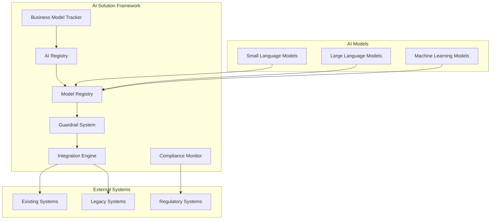

# AI Solution Framework Design Document

## Overview

The AI Solution Documentation and Compliance Framework provides a comprehensive system for managing AI technologies within the GamifyX platform. It ensures responsible AI deployment through systematic documentation, performance monitoring, safety guardrails, seamless integration, and business model tracking.

## Architecture

### High-Level Architecture



### Component Architecture

The framework follows a microservices architecture with the following core components:

1. **AI Registry Service**: Central catalog of AI technologies and datasets
2. **Model Performance Service**: Metrics tracking and validation
3. **Guardrail Service**: Safety and ethical controls
4. **Integration Service**: System connectivity and workflow management
5. **Compliance Service**: Regulatory adherence monitoring
6. **Business Intelligence Service**: Market and monetization tracking

## Components and Interfaces

### AI Registry Service

**Purpose**: Maintain comprehensive inventory of AI technologies and training datasets

**Key Features**:
- Technology catalog with version control
- Dataset provenance tracking (focus on free/open datasets)
- License management (Open Source, Creative Commons, Public Domain)
- Custom SLM documentation using free frameworks (Hugging Face, Ollama)
- Audit trail maintenance

**API Endpoints**:
```
POST /api/v1/technologies - Register new AI technology
GET /api/v1/technologies/{id} - Retrieve technology details
PUT /api/v1/technologies/{id} - Update technology information
GET /api/v1/datasets - List all training datasets
POST /api/v1/datasets - Register new dataset
```

### Model Performance Service

**Purpose**: Track and validate AI model performance metrics

**Key Features**:
- Metrics collection (accuracy, precision, recall, F-Score)
- Validation methodology documentation
- Performance trend analysis
- Benchmark management
- Alert system for performance degradation

**Metrics Schema**:
```json
{
  "modelId": "string",
  "metrics": {
    "accuracy": "number",
    "precision": "number",
    "recall": "number",
    "fScore": "number"
  },
  "validationMethod": "string",
  "testDataset": "string",
  "timestamp": "datetime"
}
```

### Guardrail Service

**Purpose**: Implement safety and ethical controls for AI outputs

**Key Features**:
- Bias detection algorithms
- Content filtering (harmful, offensive, misleading)
- Real-time monitoring
- Policy enforcement
- Intervention logging

**Guardrail Types**:
- **Input Validation**: Screen user inputs for malicious content
- **Output Filtering**: Analyze AI outputs for bias and harmful content
- **Behavioral Monitoring**: Track AI system behavior patterns
- **Compliance Checking**: Ensure outputs meet regulatory requirements

### Integration Service

**Purpose**: Manage AI solution integration with existing systems

**Key Features**:
- Standardized API gateway
- A/B testing framework
- Backward compatibility layer
- Health monitoring
- Rollback mechanisms

**Integration Patterns**:
- **API-First**: RESTful APIs for loose coupling
- **Event-Driven**: Asynchronous processing via message queues
- **Batch Processing**: Scheduled data synchronization
- **Real-Time Streaming**: Live data processing pipelines

## Data Models

### AI Technology Model
```typescript
interface AITechnology {
  id: string;
  name: string;
  type: 'LLM' | 'SLM' | 'ML' | 'Computer Vision' | 'NLP';
  version: string;
  provider: string;
  resourceType: 'Open Source' | 'Free Tier' | 'Community Edition';
  licenseTerms: string; // MIT, Apache 2.0, GPL, etc.
  deploymentDate: Date;
  status: 'Active' | 'Deprecated' | 'Testing';
  costStructure: 'Free' | 'Freemium' | 'Usage-Based Free Tier';
}
```

### Model Metrics Model
```typescript
interface ModelMetrics {
  modelId: string;
  accuracy: number;
  precision: number;
  recall: number;
  fScore: number;
  validationMethod: string;
  testDatasetSize: number;
  measurementDate: Date;
  validatedBy: string;
}
```

### Guardrail Policy Model
```typescript
interface GuardrailPolicy {
  id: string;
  name: string;
  type: 'Bias Detection' | 'Content Filter' | 'Compliance Check';
  rules: GuardrailRule[];
  severity: 'Low' | 'Medium' | 'High' | 'Critical';
  action: 'Log' | 'Block' | 'Modify' | 'Alert';
  isActive: boolean;
}
```

## Error Handling

### Error Categories

1. **Model Performance Errors**
   - Accuracy below threshold
   - Validation failures
   - Data quality issues

2. **Guardrail Violations**
   - Bias detection triggers
   - Content policy violations
   - Regulatory compliance failures

3. **Integration Errors**
   - API connectivity issues
   - Data format mismatches
   - System compatibility problems

### Error Response Strategy

```typescript
interface ErrorResponse {
  errorCode: string;
  message: string;
  severity: 'Low' | 'Medium' | 'High' | 'Critical';
  timestamp: Date;
  context: Record<string, any>;
  suggestedActions: string[];
}
```

## Testing Strategy

### Unit Testing
- Component-level testing for each service
- Mock external dependencies
- Test coverage minimum 80%

### Integration Testing
- API endpoint testing
- Database integration validation
- External system connectivity tests

### Performance Testing
- Load testing for high-volume scenarios
- Latency benchmarking
- Resource utilization monitoring

### Security Testing
- Vulnerability scanning
- Penetration testing
- Data privacy validation

### Compliance Testing
- Regulatory requirement validation
- Audit trail verification
- Policy enforcement testing

## Business Model Integration

### Free/Open Source Strategy Documentation
- Open source contribution tracking
- Community engagement metrics
- Free tier usage analytics
- Value creation through free offerings

### Market Analysis Framework
- Open source adoption rates
- Community growth metrics
- Free user conversion opportunities
- Ecosystem partnership potential

### Risk Management
- Technical risk assessment
- Market risk evaluation
- Regulatory risk monitoring
- Mitigation strategy documentation

### Scaling Strategy
- Infrastructure requirements
- Resource allocation planning
- Partnership enablers
- Technology roadmap alignment