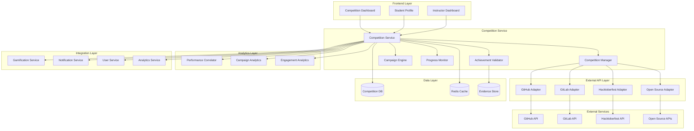

# External Competition Integration Design Document

## Overview

The External Competition Integration extends the AIOps Learning Platform with indirect gamification through real-world coding competitions. This system creates a bridge between academic learning and professional development by tracking, validating, and rewarding student participation in external competitions like Hacktoberfest, open-source contributions, and coding challenges.

**Design Philosophy:** "Real-world achievements deserve real recognition – connecting classroom learning with professional growth through meaningful external engagement."

## Architecture

### High-Level Architecture



### Technology Stack

- **Backend**: Node.js/TypeScript, Express.js, PostgreSQL, Redis
- **External APIs**: GitHub REST/GraphQL, GitLab API, Hacktoberfest API
- **Authentication**: OAuth 2.0, JWT tokens, secure credential storage
- **Analytics**: Statistical analysis libraries, correlation algorithms
- **Monitoring**: OpenTelemetry instrumentation, custom metrics
- **Security**: HashiCorp Vault integration, encrypted token storage

## Components and Interfaces

### 1. Competition Service
**Responsibility**: Core orchestration of competition-related functionality

**Key APIs**:
- `GET /competitions` - List available external competitions
- `POST /competitions/{id}/register` - Register student for competition
- `GET /competitions/{id}/progress/{userId}` - Get student progress
- `POST /competitions/{id}/evidence` - Submit achievement evidence

**Metrics Exposed**:
- `competition_registrations_total` - Total competition registrations
- `competition_completion_rate` - Competition completion percentage
- `external_api_calls_total` - External API usage tracking

### 2. Competition Manager
**Responsibility**: Competition lifecycle and student participation management

**Key Methods**:
```typescript
class CompetitionManager {
  async createCompetition(competitionData: CompetitionData): Promise<Competition>
  async registerStudent(competitionId: string, userId: string): Promise<Participation>
  async updateProgress(participationId: string, progress: ProgressData): Promise<void>
  async searchCompetitions(filters: CompetitionFilters): Promise<Competition[]>
}
```

### 3. External API Adapters
**Responsibility**: Integration with external platforms and APIs

#### GitHub Adapter
```typescript
interface GitHubAdapter {
  authenticateUser(code: string): Promise<GitHubToken>
  fetchUserContributions(username: string, dateRange: DateRange): Promise<Contribution[]>
  validatePullRequest(prUrl: string): Promise<PRValidation>
  trackRepositoryActivity(repoUrl: string, userId: string): Promise<Activity[]>
}
```

#### Hacktoberfest Adapter
```typescript
interface HacktoberfestAdapter {
  validateHacktoberfestPR(prUrl: string): Promise<HacktoberfestValidation>
  checkEligibleRepositories(repoUrls: string[]): Promise<EligibilityStatus[]>
  getHacktoberfestProgress(username: string): Promise<HacktoberfestProgress>
}
```

### 4. Achievement Validator
**Responsibility**: Verification of student achievements and evidence processing

**Key APIs**:
- `POST /validation/automatic` - Trigger automatic validation
- `POST /validation/manual` - Submit manual evidence
- `GET /validation/pending` - Get pending validations for instructor
- `PUT /validation/{id}/approve` - Approve achievement evidence

### 5. Campaign Engine
**Responsibility**: Instructor-led competition campaigns and management

**Key APIs**:
- `POST /campaigns` - Create new campaign
- `GET /campaigns/{id}/analytics` - Get campaign analytics
- `POST /campaigns/{id}/invite` - Invite students to campaign
- `GET /campaigns/{id}/progress` - Get campaign progress overview

### 6. Performance Correlator
**Responsibility**: Statistical analysis of competition impact on academic performance

**Key Methods**:
```typescript
class PerformanceCorrelator {
  async calculateCorrelation(competitionId: string, academicMetrics: AcademicData[]): Promise<CorrelationResult>
  async generateLongitudinalAnalysis(studentCohort: string[], timeRange: DateRange): Promise<LongitudinalReport>
  async comparePerformance(participatingStudents: string[], nonParticipating: string[]): Promise<ComparisonReport>
}
```

## Data Models

### Competition Schema
```typescript
interface Competition {
  id: string;
  name: string;
  type: 'hacktoberfest' | 'open-source' | 'coding-challenge' | 'hackathon';
  platform: 'github' | 'gitlab' | 'external';
  startDate: Date;
  endDate: Date;
  requirements: CompetitionRequirement[];
  validationRules: ValidationRule[];
  pointValue: number;
  badgeRewards: string[];
  status: 'upcoming' | 'active' | 'completed' | 'cancelled';
}
```

### Participation Schema
```typescript
interface Participation {
  id: string;
  userId: string;
  competitionId: string;
  registrationDate: Date;
  status: 'registered' | 'active' | 'completed' | 'withdrawn';
  progress: {
    currentMilestone: number;
    totalMilestones: number;
    completedTasks: string[];
    lastActivity: Date;
  };
  externalConnections: {
    github?: GitHubConnection;
    gitlab?: GitLabConnection;
  };
  achievements: Achievement[];
  evidenceSubmissions: EvidenceSubmission[];
}
```

### Campaign Schema
```typescript
interface Campaign {
  id: string;
  instructorId: string;
  name: string;
  description: string;
  targetCompetitions: string[];
  invitedStudents: string[];
  startDate: Date;
  endDate: Date;
  requirements: CampaignRequirement[];
  analytics: {
    participationRate: number;
    completionRate: number;
    averageScore: number;
    performanceCorrelation: number;
  };
  status: 'draft' | 'active' | 'completed' | 'cancelled';
}
```

### Evidence Submission Schema
```typescript
interface EvidenceSubmission {
  id: string;
  participationId: string;
  type: 'automatic' | 'manual';
  evidenceData: {
    urls?: string[];
    screenshots?: string[];
    descriptions?: string;
    metadata?: Record<string, any>;
  };
  validationStatus: 'pending' | 'approved' | 'rejected' | 'needs-review';
  reviewerNotes?: string;
  submissionDate: Date;
  reviewDate?: Date;
}
```

## External API Integration Strategy

### GitHub Integration
- **Authentication**: OAuth 2.0 flow with scope management
- **Data Collection**: Pull requests, commits, repository contributions
- **Rate Limiting**: Implement exponential backoff and request queuing
- **Validation**: Verify PR quality, acceptance status, and repository eligibility

### GitLab Integration
- **Authentication**: OAuth 2.0 with GitLab.com and self-hosted instances
- **Data Collection**: Merge requests, commits, project contributions
- **Webhook Support**: Real-time updates for contribution tracking
- **Validation**: Similar to GitHub with GitLab-specific criteria

### Hacktoberfest Integration
- **Validation Rules**: 
  - PR must be in eligible repository
  - PR must be accepted/merged or labeled as hacktoberfest-accepted
  - Repository must not be spam or low-quality
  - Minimum 4 valid PRs for completion

## Analytics and Performance Correlation

### Statistical Analysis Framework
```typescript
interface CorrelationAnalysis {
  participatingStudents: StudentMetrics[];
  nonParticipatingStudents: StudentMetrics[];
  correlationCoefficient: number;
  pValue: number;
  confidenceInterval: [number, number];
  effectSize: number;
  recommendations: string[];
}
```

### Metrics Tracked
- **Academic Performance**: Exam scores, assignment grades, course completion rates
- **Competition Performance**: Participation rate, completion rate, achievement quality
- **Engagement Metrics**: Platform usage, submission frequency, peer interaction
- **Long-term Outcomes**: Course retention, skill development, career progression

## Security and Privacy Considerations

### Data Protection
- **Credential Storage**: All external platform tokens encrypted using HashiCorp Vault
- **Data Minimization**: Only collect necessary data for validation and analytics
- **User Consent**: Explicit consent for external platform data collection
- **Data Retention**: Configurable retention policies for competition data

### API Security
- **Rate Limiting**: Implement per-user and global rate limits
- **Token Management**: Secure token refresh and revocation mechanisms
- **Audit Logging**: Comprehensive logging of all external API interactions
- **Error Handling**: Secure error responses without exposing sensitive information

## Integration with Existing Services

### Gamification Service Integration
```typescript
interface CompetitionGamificationRules {
  pointCalculation: {
    registration: number;
    milestoneCompletion: number;
    finalCompletion: number;
    qualityBonus: number;
  };
  badgeRules: {
    firstParticipation: BadgeDefinition;
    competitionWinner: BadgeDefinition;
    consistentParticipant: BadgeDefinition;
    mentorAchievement: BadgeDefinition;
  };
}
```

### Analytics Service Integration
- **Risk Scoring**: Include competition participation in student risk assessment
- **Performance Prediction**: Use competition data to improve academic outcome predictions
- **Engagement Analysis**: Factor external achievements into overall engagement scoring

### Notification Service Integration
- **Competition Reminders**: Automated deadline and milestone notifications
- **Achievement Celebrations**: Real-time notifications for validated achievements
- **Peer Updates**: Social notifications for peer competition progress
- **Instructor Alerts**: Campaign progress and validation request notifications

## Error Handling and Resilience

### External API Failure Handling
- **Circuit Breaker Pattern**: Prevent cascade failures from external API issues
- **Graceful Degradation**: Continue core functionality when external services are unavailable
- **Retry Logic**: Exponential backoff with jitter for transient failures
- **Fallback Mechanisms**: Manual evidence submission when automatic validation fails

### Data Consistency
- **Event Sourcing**: Track all competition-related events for audit and recovery
- **Eventual Consistency**: Handle delayed external API responses gracefully
- **Conflict Resolution**: Merge conflicting data from multiple external sources
- **Backup Validation**: Multiple validation methods for critical achievements

## Testing Strategy

### Unit Testing
- **Competition Logic**: Test competition creation, registration, and progress tracking
- **API Adapters**: Mock external APIs and test integration logic
- **Validation Rules**: Test achievement validation algorithms and edge cases

### Integration Testing
- **External APIs**: Test with sandbox/staging environments where available
- **Service Integration**: Test integration with existing platform services
- **End-to-End Workflows**: Test complete competition participation workflows

### Performance Testing
- **API Rate Limits**: Test behavior under rate limiting conditions
- **Concurrent Users**: Test system behavior with multiple simultaneous competitions
- **Data Volume**: Test with large numbers of participants and competitions

## Monitoring and Observability

### Custom Metrics
- `competition_api_response_time` - External API response time tracking
- `validation_accuracy_rate` - Automatic validation accuracy measurement
- `campaign_effectiveness_score` - Campaign success rate tracking
- `student_engagement_correlation` - Competition participation vs engagement correlation

### Alerting
- **API Failures**: Alert on external API downtime or high error rates
- **Validation Delays**: Alert when manual validation queue exceeds thresholds
- **Performance Degradation**: Alert on correlation analysis anomalies
- **Security Issues**: Alert on suspicious external platform activity

This design provides a comprehensive framework for integrating external competition tracking while maintaining security, performance, and user experience standards consistent with the existing AIOps Learning Platform.