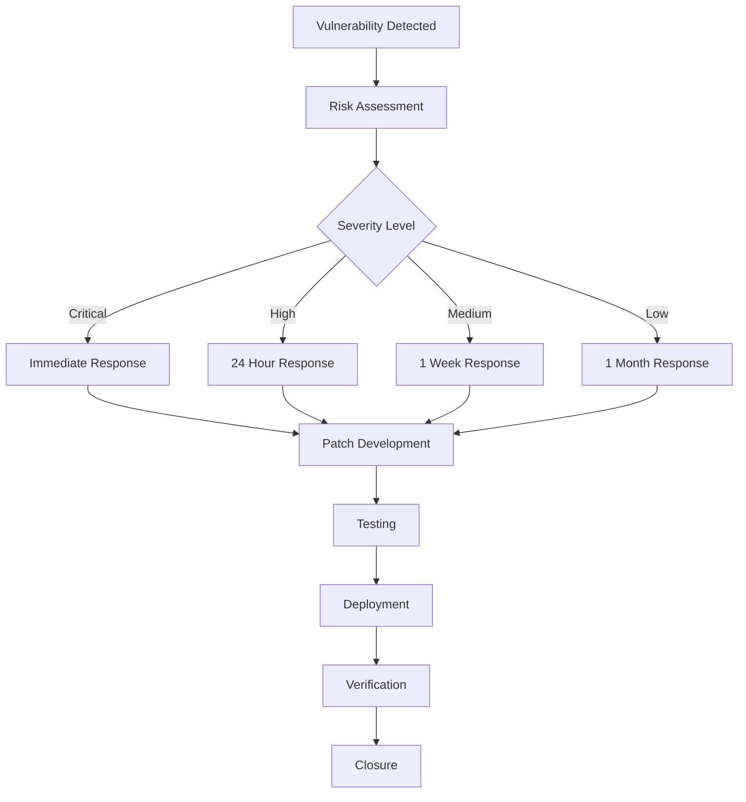

# 🔒 GamifyX Security Documentation

**Version:** 1.0.0  
**Last Updated:** October 22, 2025  
**Security Team:** GamifyX Security Operations

## 📋 Table of Contents

- [Overview](#overview)
- [Security Architecture](#security-architecture)
- [Getting Started](#getting-started)
- [Security Services](#security-services)
- [Authentication & Authorization](#authentication--authorization)
- [Data Protection](#data-protection)
- [Vulnerability Management](#vulnerability-management)
- [Compliance](#compliance)
- [Monitoring & Alerting](#monitoring--alerting)
- [Incident Response](#incident-response)
- [Security Testing](#security-testing)
- [Best Practices](#best-practices)
- [Troubleshooting](#troubleshooting)
- [Contributing](#contributing)

## 🛡️ Overview

The GamifyX platform implements a comprehensive security framework designed to protect educational data, ensure compliance with privacy regulations, and maintain the highest standards of information security. This documentation provides guidance for developers, administrators, and security professionals working with the platform.

### Security Principles

- **Defense in Depth:** Multiple layers of security controls
- **Zero Trust:** Never trust, always verify
- **Privacy by Design:** Built-in privacy protection
- **Compliance First:** Educational data privacy compliance
- **Continuous Monitoring:** Real-time threat detection
- **Automated Response:** Rapid incident containment

## 🏗️ Security Architecture

### High-Level Architecture

```
┌─────────────────────────────────────────────────────────────┐
│                    Security Perimeter                       │
├─────────────────────────────────────────────────────────────┤
│  ┌─────────────────┐  ┌─────────────────────────────────────┐│
│  │ Security        │  │ Secrets Manager                     ││
│  │ Dashboard       │  │                                     ││
│  │                 │  │ - Credential Storage                ││
│  │ - Metrics       │  │ - Automatic Rotation                ││
│  │ - Vulnerabilities│  │ - CI/CD Integration                 ││
│  │ - Compliance    │  │ - Audit Logging                     ││
│  │ - Threat Intel  │  │ - Access Control                    ││
│  └─────────────────┘  └─────────────────────────────────────┘│
├─────────────────────────────────────────────────────────────┤
│                  Application Security Layer                 │
├─────────────────────────────────────────────────────────────┤
│  ┌─────────────────┐  ┌─────────────────────────────────────┐│
│  │ Authentication  │  │ Authorization                       ││
│  │                 │  │                                     ││
│  │ - Multi-Factor  │  │ - Role-Based Access Control         ││
│  │ - JWT Tokens    │  │ - Permission Management             ││
│  │ - Session Mgmt  │  │ - Resource Protection               ││
│  │ - Password      │  │ - API Security                      ││
│  └─────────────────┘  └─────────────────────────────────────┘│
├─────────────────────────────────────────────────────────────┤
│                    Data Protection Layer                    │
├─────────────────────────────────────────────────────────────┤
│  ┌─────────────────┐  ┌─────────────────────────────────────┐│
│  │ Encryption      │  │ Data Loss Prevention                ││
│  │                 │  │                                     ││
│  │ - At Rest       │  │ - Content Filtering                 ││
│  │ - In Transit    │  │ - Access Monitoring                 ││
│  │ - Key Management│  │ - Data Classification               ││
│  │ - HSM Support   │  │ - Retention Policies                ││
│  └─────────────────┘  └─────────────────────────────────────┘│
└─────────────────────────────────────────────────────────────┘
```

### Security Components

| Component | Purpose | Port | Status |
|-----------|---------|------|--------|
| Security Dashboard | Centralized security monitoring | 3004 | ✅ Active |
| Secrets Manager | Credential and key management | 3003 | ✅ Active |
| IAM Service | Identity and access management | 3005 | 🔄 Planned |
| Vulnerability Scanner | Automated security scanning | 3006 | 🔄 Planned |
| Threat Intelligence | External threat feeds | 3007 | 🔄 Planned |

## 🚀 Getting Started

### Prerequisites

- Node.js 18+ or Docker
- PostgreSQL 14+ (for production)
- Redis 6+ (for session management)
- Basic understanding of security concepts

### Quick Start

1. **Clone the repository:**
   ```bash
   git clone https://github.com/Ananya6Daitkar/GAMIFYX-FULL.git
   cd GAMIFYX-FULL
   ```

2. **Start security services:**
   ```bash
   # Start Security Dashboard
   cd services/security-dashboard
   npm install && npm run dev

   # Start Secrets Manager
   cd ../secrets-manager
   npm install && node simple-server.js
   ```

3. **Verify services:**
   ```bash
   # Check Security Dashboard
   curl http://localhost:3004/health

   # Check Secrets Manager
   curl http://localhost:3003/health
   ```

4. **Access security interfaces:**
   - Security Dashboard: http://localhost:3004
   - Secrets Manager: http://localhost:3003
   - Security Metrics: http://localhost:3004/dashboard/metrics

### Environment Setup

Create a `.env` file in the security directory:

```env
# Security Configuration
SECURITY_DASHBOARD_PORT=3004
SECRETS_MANAGER_PORT=3003
SECURITY_LOG_LEVEL=info

# Database Configuration
POSTGRES_HOST=localhost
POSTGRES_PORT=5432
POSTGRES_DB=gamifyx_security
POSTGRES_USER=security_user
POSTGRES_PASSWORD=secure_password

# Redis Configuration
REDIS_HOST=localhost
REDIS_PORT=6379
REDIS_PASSWORD=redis_password

# Encryption Keys
ENCRYPTION_KEY=your-32-character-encryption-key
JWT_SECRET=your-jwt-secret-key
SESSION_SECRET=your-session-secret

# External Services
VAULT_URL=https://vault.example.com
VAULT_TOKEN=your-vault-token
SLACK_WEBHOOK_URL=https://hooks.slack.com/your-webhook
```

## 🔐 Security Services

### Security Dashboard

The Security Dashboard provides centralized monitoring and management of security metrics, vulnerabilities, and compliance status.

**Features:**
- Real-time security metrics
- Vulnerability tracking and management
- Compliance monitoring and reporting
- Threat intelligence integration
- Incident response coordination

**API Endpoints:**
```bash
GET /health                    # Service health check
GET /dashboard/metrics         # Security metrics
GET /dashboard/vulnerabilities # Vulnerability list
GET /dashboard/kpis           # Key performance indicators
GET /dashboard/compliance     # Compliance status
```

**Usage Example:**
```javascript
// Fetch security metrics
const response = await fetch('http://localhost:3004/dashboard/metrics');
const metrics = await response.json();
console.log('Security Score:', metrics.securityScore);
```

### Secrets Manager

The Secrets Manager handles secure storage, rotation, and distribution of sensitive credentials and keys.

**Features:**
- Secure secret storage with encryption
- Automatic secret rotation
- CI/CD pipeline integration
- Audit logging and compliance
- Role-based access control

**API Endpoints:**
```bash
POST /secrets                 # Store a secret
GET /secrets/{path}          # Retrieve a secret
DELETE /secrets/{path}       # Delete a secret
GET /rotation/schedule       # View rotation schedules
POST /cicd/secrets          # Deploy secrets to CI/CD
```

**Usage Example:**
```javascript
// Store a secret
await fetch('http://localhost:3003/secrets', {
  method: 'POST',
  headers: { 'Content-Type': 'application/json' },
  body: JSON.stringify({
    path: 'database/credentials',
    data: { username: 'dbuser', password: 'securepass' }
  })
});

// Retrieve a secret
const secret = await fetch('http://localhost:3003/secrets/database/credentials');
const credentials = await secret.json();
```

## 🔑 Authentication & Authorization

### Multi-Factor Authentication (MFA)

GamifyX supports multiple MFA methods:

- **TOTP (Time-based One-Time Password):** Google Authenticator, Authy
- **SMS:** Text message verification
- **Email:** Email-based verification
- **Hardware Tokens:** FIDO2/WebAuthn support

**Implementation:**
```javascript
// Enable MFA for a user
const mfaService = new MFAService();
const qrCode = await mfaService.enableTOTP(userId);

// Verify MFA token
const isValid = await mfaService.verifyToken(userId, token);
```

### Role-Based Access Control (RBAC)

**Predefined Roles:**
- **Student:** Basic learning platform access
- **Teacher:** Course management and student oversight
- **Administrator:** System configuration and user management
- **Security Officer:** Security monitoring and incident response
- **Auditor:** Read-only access for compliance reviews

**Permission Matrix:**
```yaml
roles:
  student:
    permissions:
      - read:own_profile
      - read:courses
      - create:submissions
      - read:own_progress
  
  teacher:
    permissions:
      - read:student_profiles
      - create:courses
      - read:submissions
      - create:feedback
  
  administrator:
    permissions:
      - "*"  # Full access
  
  security_officer:
    permissions:
      - read:security_logs
      - create:security_incidents
      - read:vulnerability_reports
```

### JWT Token Management

**Token Structure:**
```json
{
  "sub": "user123",
  "role": "student",
  "permissions": ["read:courses", "create:submissions"],
  "exp": 1640995200,
  "iat": 1640908800,
  "iss": "gamifyx-auth"
}
```

**Token Validation:**
```javascript
const jwt = require('jsonwebtoken');

function validateToken(token) {
  try {
    const decoded = jwt.verify(token, process.env.JWT_SECRET);
    return { valid: true, user: decoded };
  } catch (error) {
    return { valid: false, error: error.message };
  }
}
```

## 🛡️ Data Protection

### Encryption Standards

**At Rest:**
- **Algorithm:** AES-256-GCM
- **Key Management:** AWS KMS / HashiCorp Vault
- **Database:** Transparent Data Encryption (TDE)
- **Files:** Full disk encryption

**In Transit:**
- **Protocol:** TLS 1.3
- **Cipher Suites:** ECDHE-RSA-AES256-GCM-SHA384
- **Certificate Management:** Let's Encrypt / Internal CA
- **HSTS:** Enabled with preload

**Implementation Example:**
```javascript
const crypto = require('crypto');

class EncryptionService {
  constructor(key) {
    this.key = Buffer.from(key, 'hex');
  }

  encrypt(data) {
    const iv = crypto.randomBytes(16);
    const cipher = crypto.createCipher('aes-256-gcm', this.key, iv);
    
    let encrypted = cipher.update(data, 'utf8', 'hex');
    encrypted += cipher.final('hex');
    
    const authTag = cipher.getAuthTag();
    
    return {
      encrypted,
      iv: iv.toString('hex'),
      authTag: authTag.toString('hex')
    };
  }

  decrypt(encryptedData) {
    const decipher = crypto.createDecipher('aes-256-gcm', this.key, 
      Buffer.from(encryptedData.iv, 'hex'));
    
    decipher.setAuthTag(Buffer.from(encryptedData.authTag, 'hex'));
    
    let decrypted = decipher.update(encryptedData.encrypted, 'hex', 'utf8');
    decrypted += decipher.final('utf8');
    
    return decrypted;
  }
}
```

### Data Classification

| Classification | Description | Examples | Protection Level |
|----------------|-------------|----------|------------------|
| **Public** | Information intended for public access | Marketing materials, public documentation | Basic |
| **Internal** | Information for internal use only | Internal procedures, system documentation | Standard |
| **Confidential** | Sensitive business information | Financial data, strategic plans | Enhanced |
| **Restricted** | Highly sensitive information | Student records, personal data | Maximum |

### Privacy Controls

**Data Minimization:**
- Collect only necessary data
- Regular data purging
- Automated retention policies

**Consent Management:**
- Granular consent options
- Consent withdrawal mechanisms
- Audit trail for consent changes

**Data Subject Rights:**
- Right to access
- Right to rectification
- Right to erasure
- Right to data portability

## 🔍 Vulnerability Management

### Automated Scanning

**Tools Integrated:**
- **Trivy:** Container and filesystem scanning
- **OWASP Dependency Check:** Library vulnerability detection
- **Semgrep:** Static application security testing
- **GitLeaks:** Secret detection in code
- **Kubesec:** Kubernetes security analysis

**Scan Schedule:**
- **Daily:** Dependency and container scans
- **Weekly:** Full application security scan
- **Monthly:** Penetration testing
- **Quarterly:** External security assessment

### Vulnerability Lifecycle



### Vulnerability Reporting

**Internal Reporting:**
- Automated alerts to security team
- Integration with incident management
- Executive dashboards and reports

**External Reporting:**
- Responsible disclosure program
- Bug bounty program
- Vendor notification process

## 📊 Compliance

### Educational Data Privacy

**FERPA (Family Educational Rights and Privacy Act):**
- Student record protection
- Parental consent management
- Directory information controls
- Audit logging for access

**COPPA (Children's Online Privacy Protection Act):**
- Parental consent for users under 13
- Limited data collection
- Safe harbor provisions
- Regular compliance audits

### Data Protection Regulations

**GDPR (General Data Protection Regulation):**
- Lawful basis for processing
- Data protection impact assessments
- Privacy by design implementation
- Data breach notification procedures

**CCPA (California Consumer Privacy Act):**
- Consumer rights implementation
- Opt-out mechanisms
- Data sale restrictions
- Privacy policy requirements

### Security Standards

**SOC 2 Type II:**
- Security controls implementation
- Availability monitoring
- Processing integrity
- Confidentiality measures
- Privacy protection

**ISO 27001:**
- Information security management system
- Risk assessment and treatment
- Security policy framework
- Continuous improvement process

## 📈 Monitoring & Alerting

### Security Metrics

**Key Performance Indicators:**
- Mean Time to Detection (MTTD): 15 minutes
- Mean Time to Response (MTTR): 2 hours
- Security Score: 85/100
- Vulnerability Resolution Rate: 85%

**Monitoring Dashboards:**
```javascript
// Security metrics collection
const securityMetrics = {
  authenticationFailures: 0,
  suspiciousActivities: 0,
  vulnerabilitiesDetected: 27,
  incidentsResolved: 15,
  complianceScore: 92
};

// Real-time alerting
function checkSecurityThresholds(metrics) {
  if (metrics.authenticationFailures > 100) {
    sendAlert('High authentication failure rate detected');
  }
  
  if (metrics.vulnerabilitiesDetected > 50) {
    sendAlert('Vulnerability threshold exceeded');
  }
}
```

### Alert Configuration

**Alert Levels:**
- **Critical:** Immediate response required (SMS, phone call)
- **High:** Response within 1 hour (email, Slack)
- **Medium:** Response within 4 hours (email)
- **Low:** Daily digest (email)

**Alert Channels:**
- Email notifications
- Slack integration
- SMS alerts
- PagerDuty integration
- Webhook notifications

## 🚨 Incident Response

### Response Team Structure

**Roles and Responsibilities:**
- **Incident Commander:** Overall incident coordination
- **Security Analyst:** Technical investigation and analysis
- **Communications Lead:** Internal and external communications
- **Legal Counsel:** Regulatory and legal guidance
- **Executive Sponsor:** Strategic decisions and resources

### Response Procedures

**Phase 1: Detection and Analysis**
1. Alert triage and validation
2. Initial impact assessment
3. Incident classification
4. Team notification and assembly

**Phase 2: Containment and Eradication**
1. Immediate containment actions
2. Evidence preservation
3. Root cause analysis
4. Threat elimination

**Phase 3: Recovery and Lessons Learned**
1. System restoration
2. Monitoring for recurrence
3. Post-incident review
4. Process improvements

### Incident Types

**Security Incidents:**
- Data breaches
- Unauthorized access
- Malware infections
- DDoS attacks
- Insider threats

**Privacy Incidents:**
- Unauthorized data disclosure
- Consent violations
- Data retention violations
- Cross-border data transfers

## 🧪 Security Testing

### Testing Framework

**Automated Testing:**
- Static Application Security Testing (SAST)
- Dynamic Application Security Testing (DAST)
- Interactive Application Security Testing (IAST)
- Software Composition Analysis (SCA)

**Manual Testing:**
- Penetration testing
- Code reviews
- Architecture reviews
- Red team exercises

### Testing Schedule

```yaml
testing_schedule:
  daily:
    - dependency_scan
    - container_scan
    - secret_detection
  
  weekly:
    - sast_scan
    - dast_scan
    - infrastructure_scan
  
  monthly:
    - penetration_test
    - code_review
    - architecture_review
  
  quarterly:
    - external_assessment
    - red_team_exercise
    - compliance_audit
```

### Test Automation

```javascript
// Security test pipeline
const securityTests = [
  {
    name: 'SAST Scan',
    tool: 'semgrep',
    config: 'security/configs/semgrep.yml',
    threshold: 'high'
  },
  {
    name: 'Dependency Check',
    tool: 'owasp-dependency-check',
    config: 'security/configs/dependency-check.xml',
    threshold: 'medium'
  },
  {
    name: 'Container Scan',
    tool: 'trivy',
    config: 'security/configs/trivy.yaml',
    threshold: 'high'
  }
];

async function runSecurityTests() {
  for (const test of securityTests) {
    const result = await executeTest(test);
    if (result.severity >= test.threshold) {
      throw new Error(`Security test failed: ${test.name}`);
    }
  }
}
```

## 📚 Best Practices

### Secure Development

**Code Security:**
- Input validation and sanitization
- Output encoding
- Parameterized queries
- Error handling
- Logging and monitoring

**API Security:**
- Authentication and authorization
- Rate limiting
- Input validation
- CORS configuration
- Security headers

**Infrastructure Security:**
- Principle of least privilege
- Network segmentation
- Regular patching
- Configuration management
- Monitoring and logging

### Security Checklist

**Pre-deployment:**
- [ ] Security code review completed
- [ ] Vulnerability scan passed
- [ ] Penetration test completed
- [ ] Security configuration verified
- [ ] Monitoring and alerting configured

**Post-deployment:**
- [ ] Security monitoring active
- [ ] Incident response plan updated
- [ ] Security training completed
- [ ] Compliance verification done
- [ ] Documentation updated

## 🔧 Troubleshooting

### Common Issues

**Authentication Problems:**
```bash
# Check JWT token validity
curl -H "Authorization: Bearer <token>" http://localhost:3000/api/verify

# Reset user password
node scripts/reset-password.js --user=username

# Check MFA status
node scripts/check-mfa.js --user=username
```

**Authorization Issues:**
```bash
# Check user permissions
node scripts/check-permissions.js --user=username

# Update user role
node scripts/update-role.js --user=username --role=teacher

# Verify RBAC configuration
node scripts/verify-rbac.js
```

**Security Service Issues:**
```bash
# Check security dashboard
curl http://localhost:3004/health

# Restart secrets manager
docker restart gamifyx-secrets-manager

# Check security logs
tail -f logs/security.log
```

### Debug Mode

Enable debug logging:
```bash
export DEBUG=security:*
export LOG_LEVEL=debug
npm start
```

### Performance Issues

**Security Overhead Monitoring:**
```javascript
// Monitor security middleware performance
const performanceMonitor = {
  authenticationTime: [],
  authorizationTime: [],
  encryptionTime: []
};

function measureSecurityPerformance(operation, startTime) {
  const duration = Date.now() - startTime;
  performanceMonitor[operation].push(duration);
  
  if (duration > 1000) {
    console.warn(`Slow security operation: ${operation} took ${duration}ms`);
  }
}
```

## 🤝 Contributing

### Security Contributions

**Reporting Security Issues:**
1. **DO NOT** create public GitHub issues for security vulnerabilities
2. Email security@gamifyx.com with details
3. Include proof of concept if applicable
4. Allow 90 days for resolution before disclosure

**Security Code Reviews:**
- All security-related code requires review by security team
- Use security-focused linting rules
- Include security test cases
- Update security documentation

**Security Testing:**
- Add security tests for new features
- Update existing tests for security changes
- Verify compliance requirements
- Test incident response procedures

### Development Guidelines

**Secure Coding Standards:**
- Follow OWASP secure coding practices
- Use security linting tools
- Implement defense in depth
- Regular security training

**Documentation Requirements:**
- Security architecture diagrams
- Threat model documentation
- Security control descriptions
- Incident response procedures

## 📞 Support and Contact

### Security Team Contacts

- **Security Lead:** security-lead@gamifyx.com
- **Incident Response:** incident@gamifyx.com
- **Compliance Officer:** compliance@gamifyx.com
- **Privacy Officer:** privacy@gamifyx.com

### Emergency Contacts

- **24/7 Security Hotline:** +1-800-SECURITY
- **Incident Response Team:** Available 24/7
- **Executive Escalation:** Available on-call

### Resources

- **Security Portal:** https://security.gamifyx.com
- **Incident Response:** https://incident.gamifyx.com
- **Compliance Dashboard:** https://compliance.gamifyx.com
- **Security Training:** https://training.gamifyx.com

---

## 📄 License and Legal

This security documentation is proprietary and confidential. Distribution is restricted to authorized personnel only.

**Copyright © 2025 GamifyX Security Team. All rights reserved.**

---

*Last updated: October 22, 2025*  
*Next review: November 22, 2025*  
*Document version: 1.0.0*