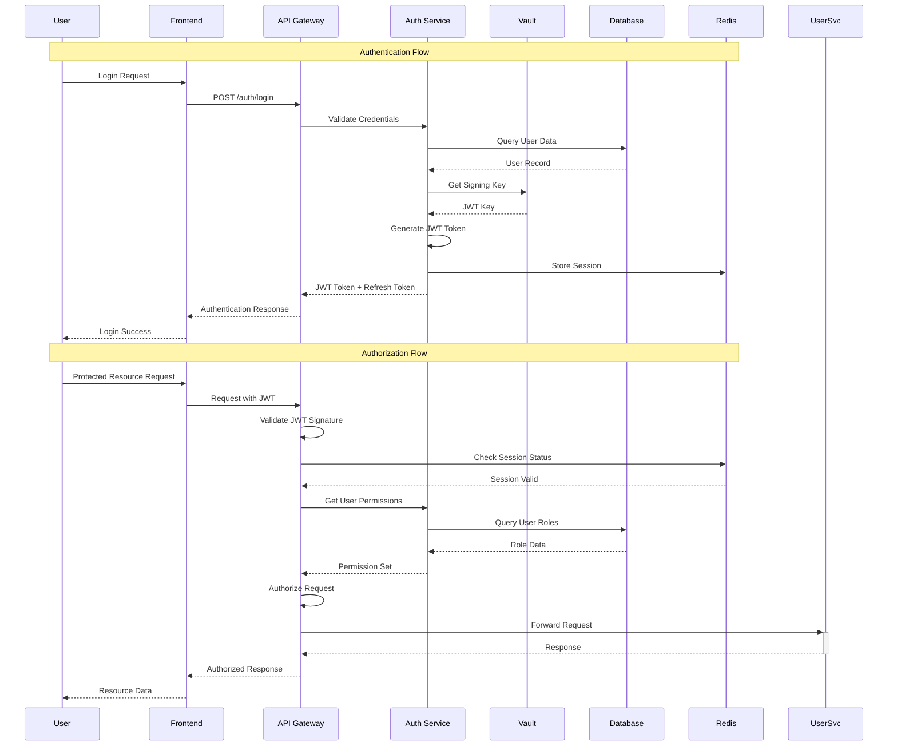
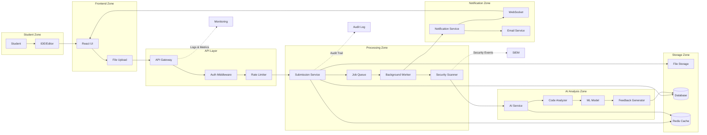
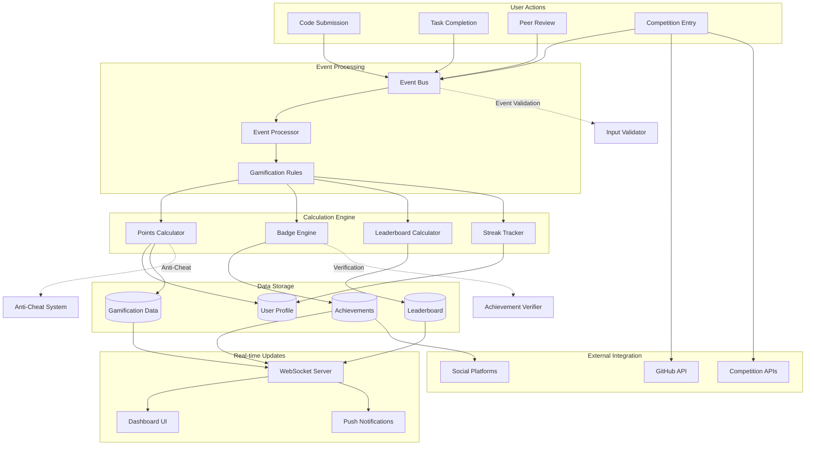
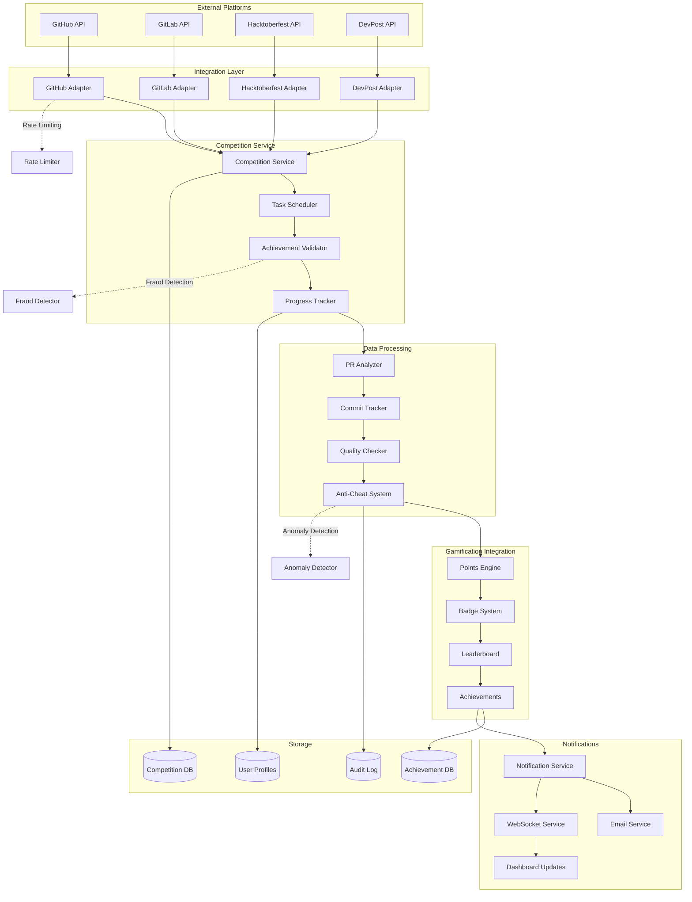

# GamifyX Data Flow Diagrams

## Overview
This document provides comprehensive data flow diagrams for the GamifyX AIOps Learning Platform, identifying all data paths, trust boundaries, and potential attack vectors.

## 1. High-Level Architecture Data Flow

```mermaid
graph TB
    subgraph "Internet Boundary"
        Student[Student User]
        Teacher[Teacher User]
        Admin[Admin User]
        Attacker[Potential Attacker]
    end
    
    subgraph "DMZ Zone"
        LB[Load Balancer]
        WAF[Web Application Firewall]
        CDN[Content Delivery Network]
    end
    
    subgraph "Application Zone"
        Gateway[API Gateway]
        Frontend[React Frontend]
        
        subgraph "Microservices"
            UserSvc[User Service]
            GameSvc[Gamification Service]
            SubmSvc[Submission Service]
            FeedSvc[Feedback Service]
            AnalSvc[Analytics Service]
            CompSvc[Competition Service]
            NotifSvc[Notification Service]
        end
        
        subgraph "AI/ML Zone"
            AISvc[AI Service]
            MLModels[ML Models]
            ModelStore[Model Storage]
        end
    end
    
    subgraph "Data Zone"
        PostgreSQL[(PostgreSQL)]
        Redis[(Redis Cache)]
        S3[File Storage]
        Vault[Secrets Vault]
    end
    
    subgraph "Monitoring Zone"
        Prometheus[Prometheus]
        Grafana[Grafana]
        Jaeger[Jaeger]
        Loki[Loki]
    end
    
    subgraph "External Services"
        GitHub[GitHub API]
        GitLab[GitLab API]
        Email[Email Service]
        SMS[SMS Service]
    end
    
    %% User flows
    Student --> LB
    Teacher --> LB
    Admin --> LB
    Attacker -.-> LB
    
    %% DMZ flows
    LB --> WAF
    WAF --> CDN
    CDN --> Gateway
    
    %% Application flows
    Gateway --> Frontend
    Gateway --> UserSvc
    Gateway --> GameSvc
    Gateway --> SubmSvc
    Gateway --> FeedSvc
    Gateway --> AnalSvc
    Gateway --> CompSvc
    Gateway --> NotifSvc
    
    %% AI flows
    FeedSvc --> AISvc
    AnalSvc --> AISvc
    AISvc --> MLModels
    MLModels --> ModelStore
    
    %% Data flows
    UserSvc --> PostgreSQL
    GameSvc --> PostgreSQL
    SubmSvc --> PostgreSQL
    FeedSvc --> PostgreSQL
    AnalSvc --> PostgreSQL
    CompSvc --> PostgreSQL
    
    UserSvc --> Redis
    GameSvc --> Redis
    SubmSvc --> S3
    
    UserSvc --> Vault
    GameSvc --> Vault
    
    %% Monitoring flows
    UserSvc --> Prometheus
    GameSvc --> Prometheus
    SubmSvc --> Prometheus
    FeedSvc --> Prometheus
    AnalSvc --> Prometheus
    CompSvc --> Prometheus
    
    Prometheus --> Grafana
    UserSvc --> Jaeger
    GameSvc --> Jaeger
    UserSvc --> Loki
    
    %% External flows
    CompSvc --> GitHub
    CompSvc --> GitLab
    NotifSvc --> Email
    NotifSvc --> SMS
    
    %% Trust boundaries
    classDef trustBoundary fill:#ff9999,stroke:#ff0000,stroke-width:3px
    classDef dmzZone fill:#ffcc99,stroke:#ff6600,stroke-width:2px
    classDef appZone fill:#99ccff,stroke:#0066cc,stroke-width:2px
    classDef dataZone fill:#99ff99,stroke:#00cc00,stroke-width:2px
    classDef monitorZone fill:#cc99ff,stroke:#6600cc,stroke-width:2px
    classDef externalZone fill:#ffff99,stroke:#cccc00,stroke-width:2px
    
    class Student,Teacher,Admin,Attacker trustBoundary
    class LB,WAF,CDN dmzZone
    class Gateway,Frontend,UserSvc,GameSvc,SubmSvc,FeedSvc,AnalSvc,CompSvc,NotifSvc,AISvc,MLModels,ModelStore appZone
    class PostgreSQL,Redis,S3,Vault dataZone
    class Prometheus,Grafana,Jaeger,Loki monitorZone
    class GitHub,GitLab,Email,SMS externalZone
```

## 2. Authentication and Authorization Flow

## 3. Submission Processing Data Flow

## 4. Gamification Data Flow

## 5. AI/ML Pipeline Data Flow

```mermaid
graph LR
    subgraph "Data Sources"
        CodeSub[Code Submissions]
        UserBehavior[User Behavior]
        Performance[Performance Data]
        Feedback[Feedback Data]
    end
    
    subgraph "Data Processing"
        Collector[Data Collector]
        Cleaner[Data Cleaner]
        Transformer[Data Transformer]
        Validator[Data Validator]
    end
    
    subgraph "Feature Engineering"
        Extractor[Feature Extractor]
        Selector[Feature Selector]
        Encoder[Feature Encoder]
        Scaler[Feature Scaler]
    end
    
    subgraph "ML Pipeline"
        Trainer[Model Trainer]
        Validator2[Model Validator]
        Registry[Model Registry]
        Deployer[Model Deployer]
    end
    
    subgraph "Inference Engine"
        Predictor[Predictor Service]
        FeedbackGen[Feedback Generator]
        RiskScorer[Risk Scorer]
        Recommender[Recommender]
    end
    
    subgraph "Model Storage"
        ModelStore[(Model Storage)]
        FeatureStore[(Feature Store)]
        MetadataStore[(Metadata Store)]
    end
    
    subgraph "Monitoring"
        DriftDetector[Drift Detector]
        PerformanceMonitor[Performance Monitor]
        BiasDetector[Bias Detector]
        Alerting[Alerting System]
    end
    
    %% Data flow
    CodeSub --> Collector
    UserBehavior --> Collector
    Performance --> Collector
    Feedback --> Collector
    
    Collector --> Cleaner
    Cleaner --> Transformer
    Transformer --> Validator
    
    %% Feature engineering
    Validator --> Extractor
    Extractor --> Selector
    Selector --> Encoder
    Encoder --> Scaler
    
    %% ML pipeline
    Scaler --> Trainer
    Trainer --> Validator2
    Validator2 --> Registry
    Registry --> Deployer
    Deployer --> ModelStore
    
    %% Inference
    ModelStore --> Predictor
    ModelStore --> FeedbackGen
    ModelStore --> RiskScorer
    ModelStore --> Recommender
    
    %% Storage
    Scaler --> FeatureStore
    Registry --> MetadataStore
    
    %% Monitoring
    Predictor --> DriftDetector
    FeedbackGen --> PerformanceMonitor
    RiskScorer --> BiasDetector
    DriftDetector --> Alerting
    PerformanceMonitor --> Alerting
    BiasDetector --> Alerting
    
    %% Security annotations
    Collector -.->|"Data Sanitization"| Sanitizer[Data Sanitizer]
    Trainer -.->|"Model Security"| SecScanner[Security Scanner]
    Predictor -.->|"Input Validation"| InputVal[Input Validator]
```

## 6. Competition Integration Data Flow

## Trust Boundaries and Attack Vectors

### Trust Boundary 1: Internet to DMZ
- **Assets**: Load balancer, WAF, CDN
- **Threats**: DDoS, malicious traffic, bot attacks
- **Controls**: Rate limiting, IP filtering, geographic blocking

### Trust Boundary 2: DMZ to Application Zone
- **Assets**: API Gateway, microservices
- **Threats**: API abuse, injection attacks, unauthorized access
- **Controls**: Authentication, input validation, API rate limiting

### Trust Boundary 3: Application to Data Zone
- **Assets**: Databases, caches, file storage
- **Threats**: Data breaches, SQL injection, unauthorized data access
- **Controls**: Encryption, access controls, network segmentation

### Trust Boundary 4: Application to External Services
- **Assets**: GitHub API, email services, third-party APIs
- **Threats**: API key compromise, data leakage, service abuse
- **Controls**: API key rotation, request signing, monitoring

### Trust Boundary 5: AI/ML Zone
- **Assets**: ML models, training data, inference engines
- **Threats**: Model poisoning, adversarial attacks, bias exploitation
- **Controls**: Data validation, model versioning, bias testing

## Data Classification

### Highly Sensitive Data
- User passwords and authentication tokens
- Personal identifiable information (PII)
- Student academic records
- Payment information (if applicable)

### Sensitive Data
- User profiles and preferences
- Code submissions and feedback
- Competition participation data
- Performance analytics

### Internal Data
- System logs and metrics
- Configuration data
- API keys and secrets
- Model parameters

### Public Data
- Leaderboards (anonymized)
- Public achievements
- General platform statistics
- Documentation and help content

## Security Controls Mapping

| Data Flow | Security Control | Implementation |
|-----------|------------------|----------------|
| User Authentication | Multi-factor Authentication | TOTP, SMS, Email |
| API Communication | TLS 1.3 Encryption | Certificate pinning |
| Database Access | Encryption at Rest | AES-256 encryption |
| File Storage | Access Controls | IAM policies, signed URLs |
| Inter-service Communication | mTLS | Certificate-based authentication |
| External API Calls | API Key Management | Vault-based key rotation |
| User Input | Input Validation | Schema validation, sanitization |
| Code Submissions | Malware Scanning | Static analysis, sandboxing |
| AI Model Inference | Rate Limiting | Per-user quotas |
| Competition Data | Fraud Detection | Anomaly detection algorithms |