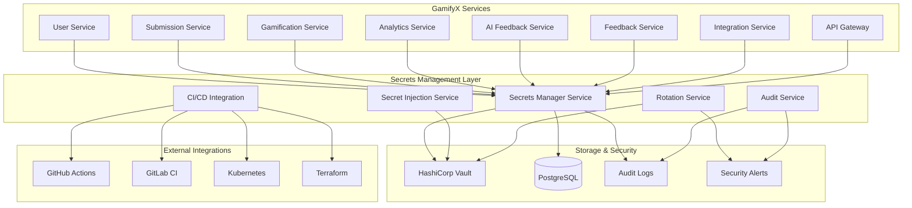

# GamifyX Comprehensive Secrets Management System

## 🔐 Overview

The GamifyX Comprehensive Secrets Management System provides enterprise-grade security for all sensitive data across the platform. Built on HashiCorp Vault Community Edition, it offers automated rotation, secure CI/CD integration, comprehensive audit logging, and compliance reporting.

## 🏗️ Architecture



## 🚀 Quick Start

### 1. Prerequisites

```bash
# Install required tools
brew install hashicorp/tap/vault  # macOS
# or
sudo apt-get install vault        # Ubuntu

# Verify installation
vault --version
```

### 2. Start the System

```bash
# Start all services including Vault
docker-compose -f docker-compose.yml -f docker-compose.secrets.yml up -d

# Run the comprehensive setup script
cd services/secrets-manager
./scripts/setup-comprehensive-secrets.sh

# Verify setup
curl http://localhost:3003/health
```

### 3. Access Interfaces

- **Secrets Manager API**: http://localhost:3003
- **Vault UI**: http://localhost:8200/ui (token: `dev-token`)
- **Optional Vault UI**: http://localhost:8000 (if using vault-ui profile)

## 🔧 Core Features

### 1. Automated Secret Rotation

```bash
# Configure rotation for a secret
curl -X POST http://localhost:3003/secrets \
  -H "Authorization: Bearer $JWT_TOKEN" \
  -H "Content-Type: application/json" \
  -d '{
    "name": "database-password",
    "path": "user-service/production/db-password",
    "type": "database_password",
    "value": "super-secure-password",
    "rotationConfig": {
      "enabled": true,
      "intervalDays": 90,
      "strategy": "database_rotate",
      "notifyBefore": 7
    }
  }'

# Force immediate rotation
curl -X POST http://localhost:3003/rotation/force \
  -H "Authorization: Bearer $JWT_TOKEN" \
  -H "Content-Type: application/json" \
  -d '{
    "secretPath": "user-service/production/db-password",
    "reason": "Security incident response"
  }'
```

### 2. CI/CD Integration

#### GitHub Actions

```yaml
# .github/workflows/deploy.yml
name: Deploy with Secrets
on:
  push:
    branches: [main]

jobs:
  deploy:
    runs-on: ubuntu-latest
    steps:
      - uses: actions/checkout@v3
      
      - name: Get secrets from Vault
        run: |
          curl -X POST http://secrets-manager:3003/cicd/secrets \
            -H "Authorization: Bearer ${{ secrets.VAULT_TOKEN }}" \
            -H "Content-Type: application/json" \
            -d '{
              "pipelineId": "${{ github.run_id }}",
              "environment": "production",
              "service": "user-service",
              "platform": "github-actions"
            }' > secrets.json
          
      - name: Deploy application
        env:
          SECRETS: ${{ fromJson(steps.secrets.outputs.result) }}
        run: |
          # Your deployment commands here
          echo "Deploying with secure secrets..."
```

#### Kubernetes

```bash
# Generate Kubernetes secrets
curl -X POST http://localhost:3003/cicd/kubernetes \
  -H "Authorization: Bearer $JWT_TOKEN" \
  -H "Content-Type: application/json" \
  -d '{
    "namespace": "production",
    "service": "user-service",
    "environment": "production"
  }' | kubectl apply -f -
```

#### Terraform

```hcl
# Use Vault provider for secrets
provider "vault" {
  address = "http://vault:8200"
  token   = var.vault_token
}

data "vault_generic_secret" "db_password" {
  path = "aiops-secrets/data/user-service/production/db-password"
}

resource "kubernetes_secret" "app_secrets" {
  metadata {
    name      = "user-service-secrets"
    namespace = "production"
  }

  data = {
    DB_PASSWORD = data.vault_generic_secret.db_password.data["value"]
  }
}
```

### 3. Secret Injection

```bash
# Inject secrets for all services
curl -X POST http://localhost:3003/injection/inject-all \
  -H "Authorization: Bearer $JWT_TOKEN" \
  -H "Content-Type: application/json" \
  -d '{"environment": "production"}'

# Inject secrets for specific service
curl -X POST http://localhost:3003/injection/inject \
  -H "Authorization: Bearer $JWT_TOKEN" \
  -H "Content-Type: application/json" \
  -d '{
    "service": "user-service",
    "environment": "production",
    "format": "env",
    "secretPaths": [
      "user-service/production/jwt-secret",
      "user-service/production/db-password",
      "common/production/redis-password"
    ]
  }'

# Setup GamifyX-specific secrets
curl -X POST http://localhost:3003/injection/gamifyx-setup \
  -H "Authorization: Bearer $JWT_TOKEN" \
  -H "Content-Type: application/json" \
  -d '{"environment": "production"}'
```

### 4. Comprehensive Audit Logging

```bash
# Get audit trail
curl "http://localhost:3003/audit/trail?userId=user123&startDate=2024-01-01" \
  -H "Authorization: Bearer $JWT_TOKEN"

# Get security alerts
curl "http://localhost:3003/audit/alerts?severity=high" \
  -H "Authorization: Bearer $JWT_TOKEN"

# Generate compliance report
curl -X POST http://localhost:3003/audit/compliance/report \
  -H "Authorization: Bearer $JWT_TOKEN" \
  -H "Content-Type: application/json" \
  -d '{
    "framework": "SOC2",
    "startDate": "2024-01-01",
    "endDate": "2024-12-31"
  }'
```

## 🛡️ Security Features

### 1. Access Control Policies

```hcl
# Service-specific access policy
path "aiops-secrets/data/user-service/*" {
  capabilities = ["read"]
}

path "aiops-secrets/data/common/*" {
  capabilities = ["read"]
}

# Dynamic database credentials
path "database/creds/readonly" {
  capabilities = ["read"]
}
```

### 2. Dynamic Database Credentials

```bash
# Get temporary database credentials
vault read database/creds/readwrite

# Output:
# Key                Value
# ---                -----
# lease_id           database/creds/readwrite/abc123
# lease_duration     1h
# lease_renewable    true
# password           A1a-xyz789
# username           v-token-readwrite-abc123
```

### 3. Encryption at Rest and in Transit

- All secrets encrypted using Vault's built-in encryption
- TLS encryption for all API communications
- Additional application-level encryption for sensitive data
- Master key rotation capabilities

### 4. Security Monitoring

```bash
# Real-time security alerts
curl "http://localhost:3003/audit/alerts?status=open" \
  -H "Authorization: Bearer $JWT_TOKEN"

# Security statistics
curl "http://localhost:3003/audit/stats" \
  -H "Authorization: Bearer $JWT_TOKEN"
```

## 📊 Monitoring and Observability

### 1. Prometheus Metrics

```yaml
# Available metrics
- vault_operations_total
- secret_access_total
- rotation_jobs_total
- cicd_secret_requests_total
- audit_events_total
- security_alerts_total
```

### 2. Grafana Dashboards

```json
{
  "dashboard": {
    "title": "Secrets Management Overview",
    "panels": [
      {
        "title": "Secret Access Rate",
        "type": "graph",
        "targets": [
          {
            "expr": "rate(secret_access_total[5m])"
          }
        ]
      },
      {
        "title": "Rotation Success Rate",
        "type": "stat",
        "targets": [
          {
            "expr": "rate(rotation_jobs_total{status=\"completed\"}[1h]) / rate(rotation_jobs_total[1h])"
          }
        ]
      }
    ]
  }
}
```

### 3. Health Checks

```bash
# Service health
curl http://localhost:3003/health

# Vault health
curl http://localhost:3003/health/vault

# Database health
curl http://localhost:3003/health/database
```

## 🔄 Rotation Strategies

### 1. Automatic Rotation

```javascript
// Configure automatic rotation
const rotationConfig = {
  enabled: true,
  intervalDays: 90,
  strategy: "regenerate", // or "database_rotate", "api_refresh"
  notifyBefore: 7,
  maxRetries: 3,
  backoffMultiplier: 2
};
```

### 2. Manual Rotation

```bash
# Force rotation via API
curl -X POST http://localhost:3003/rotation/force \
  -H "Authorization: Bearer $JWT_TOKEN" \
  -d '{"secretPath": "user-service/production/jwt-secret"}'

# Vault CLI
vault write -force auth/jwt/rotate
```

### 3. Rotation Monitoring

```bash
# Get rotation schedule
curl http://localhost:3003/rotation/schedule \
  -H "Authorization: Bearer $JWT_TOKEN"

# Get rotation jobs
curl "http://localhost:3003/rotation/jobs?secretPath=user-service/production/jwt-secret" \
  -H "Authorization: Bearer $JWT_TOKEN"
```

## 📋 Compliance and Auditing

### 1. Supported Frameworks

- **SOC 2**: System and Organization Controls
- **GDPR**: General Data Protection Regulation
- **HIPAA**: Health Insurance Portability and Accountability Act
- **PCI DSS**: Payment Card Industry Data Security Standard
- **NIST**: National Institute of Standards and Technology
- **ISO 27001**: Information Security Management

### 2. Audit Events

```json
{
  "id": "audit_1640995200_abc123",
  "timestamp": "2024-01-01T00:00:00Z",
  "eventType": "secret_access",
  "userId": "user123",
  "secretPath": "user-service/production/jwt-secret",
  "action": "read",
  "result": "success",
  "ipAddress": "192.168.1.100",
  "userAgent": "GamifyX-Client/1.0",
  "riskLevel": "low",
  "complianceFrameworks": ["SOC2", "GDPR"]
}
```

### 3. Compliance Reports

```bash
# Generate SOC 2 compliance report
curl -X POST http://localhost:3003/audit/compliance/report \
  -H "Authorization: Bearer $JWT_TOKEN" \
  -d '{
    "framework": "SOC2",
    "startDate": "2024-01-01",
    "endDate": "2024-12-31"
  }'
```

## 🚨 Incident Response

### 1. Security Alerts

```json
{
  "id": "alert_1640995200_xyz789",
  "timestamp": "2024-01-01T00:00:00Z",
  "alertType": "unusual_access",
  "severity": "high",
  "userId": "user123",
  "description": "User accessed 50+ secrets in 1 hour",
  "evidence": [...],
  "mitigationSteps": [
    "Review user access patterns",
    "Verify legitimate business need",
    "Check for automated tools or scripts"
  ],
  "status": "open"
}
```

### 2. Emergency Procedures

```bash
# Revoke all tokens for a user
vault write auth/jwt/revoke user_id=user123

# Emergency secret rotation
curl -X POST http://localhost:3003/rotation/force \
  -d '{"secretPath": "*", "reason": "Security breach"}'

# Disable user access
vault write auth/jwt/users/user123 policies=""
```

## 🔧 Configuration

### 1. Environment Variables

```bash
# Core Configuration
VAULT_ENDPOINT=http://vault:8200
VAULT_TOKEN=dev-token
DB_HOST=postgres
DB_PASSWORD=password

# Security Configuration
JWT_SECRET=your-jwt-secret
ENCRYPTION_KEY=your-encryption-key

# Audit Configuration
AUDIT_LOG_PATH=/app/logs/audit
AUDIT_RETENTION_DAYS=90

# Rotation Configuration
ROTATION_DEFAULT_INTERVAL_DAYS=90
ROTATION_CHECK_INTERVAL=3600000

# Notification Configuration
SLACK_WEBHOOK_URL=https://hooks.slack.com/...
EMAIL_HOST=smtp.gmail.com
```

### 2. Vault Configuration

```hcl
# vault-config.hcl
storage "file" {
  path = "/vault/data"
}

listener "tcp" {
  address = "0.0.0.0:8200"
  tls_disable = 1
}

api_addr = "http://127.0.0.1:8200"
cluster_addr = "https://127.0.0.1:8201"
ui = true
```

## 🧪 Testing

### 1. Unit Tests

```bash
cd services/secrets-manager
npm test
```

### 2. Integration Tests

```bash
# Test Vault integration
npm run test:vault

# Test rotation functionality
npm run test:rotation

# Test CI/CD integration
npm run test:cicd
```

### 3. Security Tests

```bash
# Run security scan
npm run security:scan

# Test access controls
npm run test:access

# Validate audit logging
npm run test:audit
```

## 📚 API Reference

### Authentication

All API endpoints require JWT authentication:

```bash
Authorization: Bearer <jwt-token>
```

### Endpoints

#### Secrets Management

- `POST /secrets` - Create secret
- `GET /secrets/{path}` - Get secret
- `PUT /secrets/{path}` - Update secret
- `DELETE /secrets/{path}` - Delete secret
- `GET /secrets` - List secrets

#### Rotation Management

- `GET /rotation/schedule` - Get rotation schedule
- `POST /rotation/force` - Force rotation
- `GET /rotation/jobs` - Get rotation jobs

#### CI/CD Integration

- `POST /cicd/secrets` - Get secrets for pipeline
- `POST /cicd/github-actions` - Generate GitHub Actions config
- `POST /cicd/kubernetes` - Generate Kubernetes config
- `POST /cicd/terraform` - Generate Terraform config

#### Secret Injection

- `POST /injection/inject` - Inject secrets
- `POST /injection/inject-all` - Inject all service secrets
- `POST /injection/gamifyx-setup` - Setup GamifyX secrets

#### Audit and Compliance

- `GET /audit/trail` - Get audit trail
- `GET /audit/alerts` - Get security alerts
- `POST /audit/compliance/report` - Generate compliance report

## 🚀 Deployment

### 1. Development

```bash
# Start development environment
docker-compose -f docker-compose.yml -f docker-compose.secrets.yml up -d

# Run setup script
./services/secrets-manager/scripts/setup-comprehensive-secrets.sh
```

### 2. Production

```bash
# Use production Vault configuration
export VAULT_ENDPOINT=https://vault.production.com
export VAULT_TOKEN=production-token

# Deploy with Kubernetes
kubectl apply -f k8s/secrets-manager/

# Configure production secrets
./scripts/setup-production-secrets.sh
```

### 3. High Availability

```yaml
# vault-ha.yml
apiVersion: apps/v1
kind: StatefulSet
metadata:
  name: vault
spec:
  replicas: 3
  template:
    spec:
      containers:
      - name: vault
        image: hashicorp/vault:latest
        env:
        - name: VAULT_RAFT_NODE_ID
          valueFrom:
            fieldRef:
              fieldPath: metadata.name
```

## 🔍 Troubleshooting

### Common Issues

1. **Vault Connection Failed**
   ```bash
   # Check Vault status
   vault status
   
   # Verify network connectivity
   curl http://vault:8200/v1/sys/health
   ```

2. **Secret Access Denied**
   ```bash
   # Check token permissions
   vault token lookup
   
   # Verify policy assignment
   vault read auth/jwt/users/username
   ```

3. **Rotation Failed**
   ```bash
   # Check rotation logs
   curl http://localhost:3003/rotation/jobs?status=failed
   
   # Verify external service connectivity
   vault read database/config/postgresql
   ```

### Debug Mode

```bash
# Enable debug logging
export LOG_LEVEL=debug
export ENABLE_DEBUG_LOGGING=true

# Start service with debug output
npm run dev
```

## 📈 Performance Optimization

### 1. Caching

```javascript
// Configure caching
const cacheConfig = {
  ttl: 300, // 5 minutes
  maxSize: 1000,
  enabled: true
};
```

### 2. Connection Pooling

```javascript
// Database connection pool
const poolConfig = {
  min: 5,
  max: 20,
  acquireTimeoutMillis: 30000,
  idleTimeoutMillis: 600000
};
```

### 3. Rate Limiting

```javascript
// API rate limiting
const rateLimitConfig = {
  windowMs: 15 * 60 * 1000, // 15 minutes
  max: 1000, // requests per window
  standardHeaders: true
};
```

## 🤝 Contributing

1. Fork the repository
2. Create a feature branch
3. Make your changes
4. Add tests for new functionality
5. Run the test suite
6. Submit a pull request

## 📄 License

This project is licensed under the MIT License - see the [LICENSE](LICENSE) file for details.

## 🆘 Support

- **Documentation**: Check this guide and API documentation
- **Issues**: Create an issue in the repository
- **Security**: Report security issues to security@gamifyx.com
- **Community**: Join our Discord server for discussions

---

*This comprehensive guide covers all aspects of the GamifyX Secrets Management System. For additional help, please refer to the API documentation or contact the development team.*